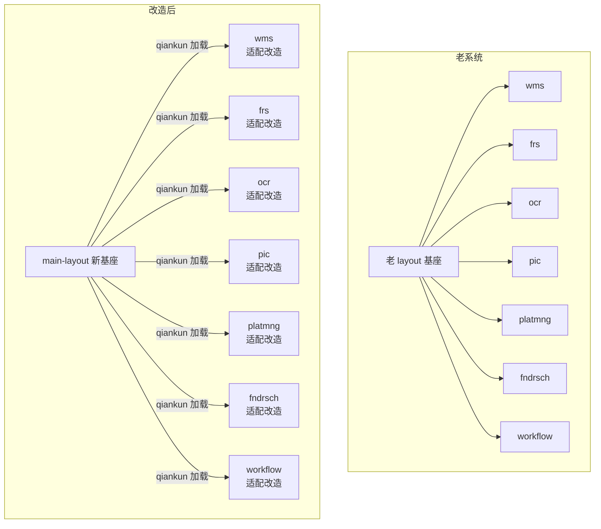
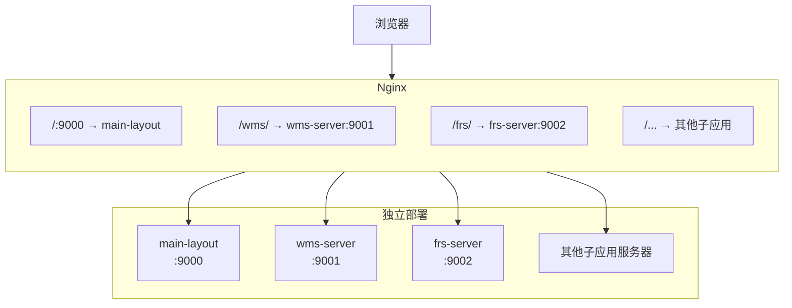
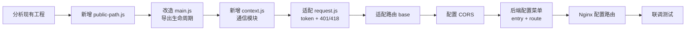
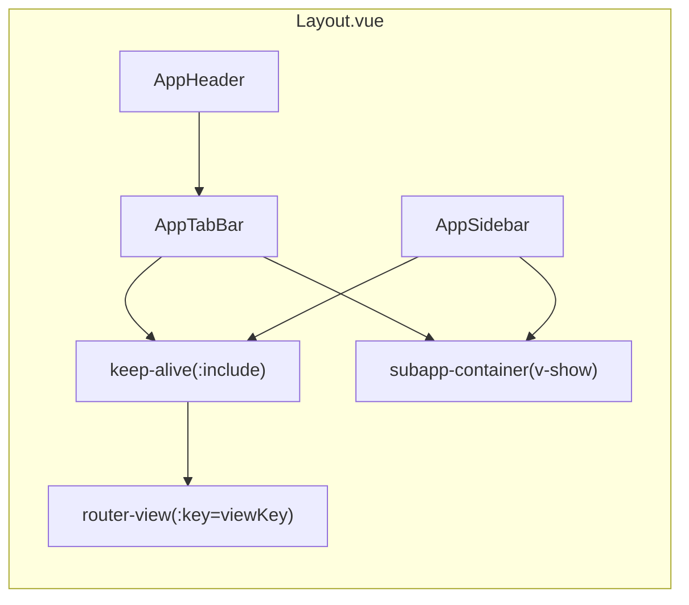
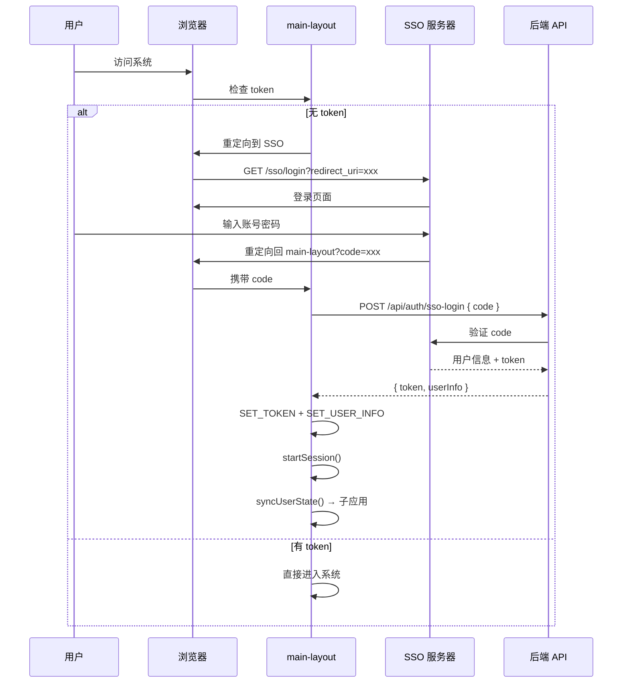
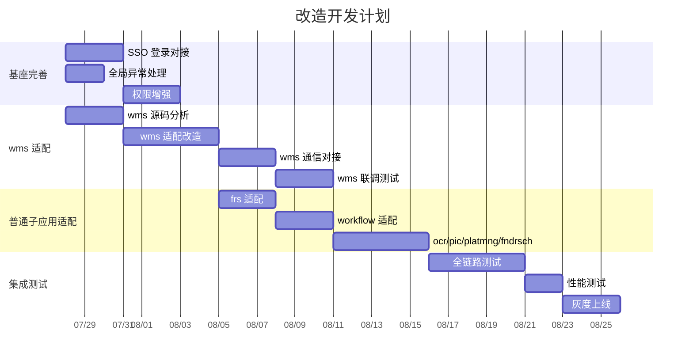

# 前端框架迁移改造方案


> 版本：v3.0
> 日期：2026-07-27
> 面向：技术负责人、开发人员、项目经理


---


# 一、改造背景与目标


## 1.1 改造背景


老系统采用 **layout 基座 + 多个子应用** 的传统架构，所有应用部署在同一域名下，由 layout 统一管理菜单、登录、子应用加载等。随着业务增长，该架构暴露以下问题：

- 子应用之间缺乏隔离，样式冲突、全局变量污染频发
- layout 基座耦合严重，新增/修改子应用需改动基座代码
- 缺少标签页管理、页面缓存等企业级 Layout 能力
- 各子应用构建、部署方式不统一


为此，决定引入基于 **qiankun 微前端** 的新框架基座（main-layout），对老系统进行改造。


## 1.2 改造原则


1. **不采用 monorepo**：各子应用保留原有工程结构和独立仓库，不做代码搬迁。
2. **基座替换**：用新框架 main-layout 替换老 layout 基座，提供统一的登录、菜单、标签页、通信等能力。
3. **最小改动**：子应用仅做适配性改造（添加 qiankun 生命周期 + 通信模块），不重构业务代码。
4. **独立部署**：各子应用仍独立构建、独立部署，通过 URL 被基座加载。
5. **渐进式接入**：分批次接入子应用，新老系统可并行运行。


## 1.3 改造前后架构对比




**核心变化**：老 layout 被 main-layout 替换，各子应用保留原有工程，仅新增适配代码。


---


# 二、新框架基座（main-layout）能力概览


## 2.1 技术栈


| 类别 | 技术 | 版本 |
|------|------|------|
| 框架 | Vue 2 | ^2.7.16 |
| 路由 | Vue Router | ^3.6.5 |
| 状态管理 | Vuex | ^3.6.2 |
| HTTP | axios | ^1.6.0 |
| 微前端 | qiankun | ^2.10.0 |
| 构建 | Webpack | ^4.46.0 |
| 语言 | JavaScript（ES6+） | - |
| 配置体系 | CommonJS | - |
| Node | 18 | - |


## 2.2 工程结构


```
main-layout/
├── src/
│   ├── api/                  # API 接口层
│   │   ├── user.js           # 用户登录、用户信息
│   │   └── menu.js           # 菜单获取
│   ├── layout/               # 布局组件
│   │   ├── Layout.vue        # 主布局（Header + Sidebar + TabBar + Content）
│   │   ├── AppHeader.vue     # 顶部栏（用户信息、退出按钮）
│   │   ├── AppSidebar.vue    # 侧边栏（动态菜单渲染）
│   │   └── AppTabBar.vue     # 标签页栏（拖拽排序、右键菜单、双击关闭）
│   ├── micro/                # 微前端核心
│   │   ├── apps.js           # 子应用注册配置（从菜单数据动态生成）
│   │   └── globalState.js    # qiankun 全局状态初始化
│   ├── platform/             # 平台能力
│   │   ├── session.js        # Session 超时检测（30分钟无操作自动退出）
│   │   └── bridge.js         # 主子应用通信桥梁（含标签页事件同步）
│   ├── router/               # 路由
│   │   ├── index.js          # Vue Router 实例
│   │   ├── routes.js         # 路由定义
│   │   └── guards.js         # 路由守卫（权限校验、标签页自动创建、deep-link 恢复）
│   ├── store/                # Vuex 状态管理
│   │   ├── index.js          # 根 Store（token/userInfo/menu + tabs 模块合并）
│   │   └── tabs.js           # 标签页状态管理（增删改查、持久化、缓存控制）
│   ├── utils/                # 工具函数
│   │   ├── auth.js           # Token 存取（localStorage）
│   │   ├── logout.js         # 统一退出流程
│   │   ├── message.js        # 消息提示
│   │   └── request.js        # Axios 封装（token 注入、401/418 处理）
│   ├── views/                # 页面
│   │   ├── Login.vue         # 登录页（含 deep-link 恢复）
│   │   └── Home.vue          # 首页
│   ├── App.vue               # 根组件
│   └── main.js               # 入口（qiankun 生命周期 + 标签页恢复）
├── webpack.config.js
├── package.json
└── .env.dev / .env.test / .env.prod
```


## 2.3 已具备能力


| 能力 | 状态 | 说明 |
|------|------|------|
| Token 管理 | 已实现 | localStorage 存取（key: fmac_token） |
| Session 超时 | 已实现 | 30分钟无操作自动退出 |
| Axios 封装 | 已实现 | token 注入 + 401/418 拦截 |
| 全局状态通信 | 已实现 | initGlobalState 双向通信 |
| 动态子应用注册 | 已实现 | 从后端菜单数据动态生成，无需硬编码 |
| 路由守卫 | 已实现 | 权限校验 + 页面标题 + deep-link 恢复 |
| 标签页管理 | 已实现 | 创建/切换/关闭/刷新/右键菜单（6种操作） |
| 标签页拖拽排序 | 已实现 | HTML5 Drag and Drop API |
| 标签页双击关闭 | 已实现 | 双击可关闭标签 |
| 标签页持久化 | 已实现 | localStorage 持久化，刷新/登录后可恢复 |
| 页面缓存 | 已实现 | keep-alive 动态 include + 组件名匹配 |
| 标签页状态同步 | 已实现 | 主子应用通过 globalState 同步标签事件 |
| Deep-link 恢复 | 已实现 | 登录前保存目标 URL，登录后自动跳转 |
| 统一退出 | 已实现 | bridge 通知所有子应用同步退出 |
| 样式隔离 | 已实现 | qiankun experimentalStyleIsolation |
| Nginx 部署 | 已实现 | 多域名 / 单域名两种方案 |


## 2.4 待建设能力


| 能力 | 状态 | 说明 |
|------|------|------|
| SSO 对接 | 未实现 | 当前为 mock 登录，需对接实际 SSO |
| 按钮级权限 | 未实现 | 当前仅路由级守卫 |
| 全局异常上报 | 未实现 | 待确认是否需要 |


---


# 三、改造总体方案


## 3.1 改造思路


```
┌──────────────────────────────────────────────────────────┐
│                     改造思路                              │
│                                                          │
│  1. 新基座 main-layout 独立部署，替换老 layout            │
│  2. 各子应用保留原有工程和仓库                            │
│  3. 每个子应用新增 3 个适配文件：                          │
│     ├── public-path.js    （动态资源路径）                 │
│     ├── context.js        （与基座通信）                   │
│     └── main.js 改造      （导出 qiankun 生命周期）        │
│  4. 每个子应用改造 2 个文件：                              │
│     ├── request.js        （适配 token 规范和 401/418）    │
│     └── webpack.config.js （dev-server 添加 CORS）         │
│  5. 后端菜单接口配置各子应用的 entry 和 route              │
│  6. Nginx 配置各子应用的访问路径                           │
└──────────────────────────────────────────────────────────┘
```


## 3.2 部署架构




各应用独立部署，Nginx 统一路由分发。main-layout 通过 qiankun 按 URL 加载子应用。


## 3.3 改造批次


采用 **渐进式接入** 策略，分三批改造：


| 批次 | 应用 | 优先级 | 复杂度 | 说明 |
|------|------|--------|--------|------|
| 第一批 | wms | P0 | 高 | 最复杂业务应用，优先验证基座能力 |
| 第二批 | frs、workflow | P1 | 中 | 中等复杂度，验证通用接入流程 |
| 第三批 | ocr、pic、platmng、fndrsch | P2 | 低 | 相对简单，可批量推进 |


## 3.4 子应用适配标准流程


每个子应用的适配改造遵循统一流程：





### 适配清单


| 步骤 | 改造内容 | 改动量 | 产出 |
|------|---------|--------|------|
| 1 | 新增 `public-path.js` | 新增 1 文件（~5行） | 资源路径正确 |
| 2 | 改造 `main.js` 导出 qiankun 生命周期 | 改动入口文件 | qiankun 可加载 |
| 3 | 新增 `context.js` 通信模块 | 新增 1 文件（~20行） | 与基座通信正常 |
| 4 | 适配 `request.js` token 注入 + 401/418 | 改动拦截器 | 认证 + 退出正常 |
| 5 | 路由 base 适配 | 改动 router 配置 | 路由跳转正确 |
| 6 | Webpack dev-server 添加 CORS 头 | 改动 1 行配置 | 跨域正常 |
| 7 | 后端菜单配置 entry + route | 配置变更 | 基座自动注册 |


---


# 四、基座对接方案（main-layout 侧）


## 4.1 子应用动态注册


基座从后端菜单接口获取子应用列表，动态注册到 qiankun：


```javascript
// micro/apps.js
export function getApps() {
  var menu = store.state.menu;
  if (menu && menu.length > 0) {
    return menu
      .filter(function(item) { return item.entry; })
      .map(function(item) {
        return {
          name: item.app_code,
          entry: item.entry,
          container: '#subapp-container',
          activeRule: item.route
        };
      });
  }
  return [];
}
```


菜单数据结构（后端接口返回）：


```json
[
  {
    "app_code": "wms",
    "app_name": "仓储管理",
    "entry": "//wms-server:9001",
    "route": "/wms",
    "permission": ["view"]
  },
  {
    "app_code": "frs",
    "app_name": "资金结算",
    "entry": "//frs-server:9002",
    "route": "/frs",
    "permission": ["view"]
  }
]
```


## 4.2 Layout 布局结构




- 主应用页面（首页等）走 `keep-alive + router-view`，支持缓存
- 子应用页面走 `subapp-container`，由 qiankun 管理渲染
- `v-if` / `v-show` 互斥，两者不会同时渲染


## 4.3 标签页管理


标签页管理是基座的核心能力，老 layout 有此能力，新基座已完整实现。


### 数据结构


```javascript
// store/tabs.js
state: {
  visitedViews: [
    {
      id: '/home',              // 唯一标识（path + 排序后 query）
      title: '首页',            // 标签标题
      path: '/home',            // 路由路径
      fullPath: '/home',        // 完整路径（含 query）
      name: 'Home',             // 组件名（用于 keep-alive）
      params: {},               // 路由参数
      query: {},                // 查询参数
      closable: false,          // 是否可关闭（首页不可关闭）
      keepAlive: true,          // 是否缓存
      isSubApp: false           // 是否子应用
    }
  ],
  cachedViews: ['Home'],        // keep-alive include 列表
  routerViewState: true         // 路由视图状态（用于刷新控制）
}
```


### 已实现功能


| 功能 | 说明 | 实现方式 |
|------|------|---------|
| 标签新增 | 路由切换时自动新增 | afterEach 守卫 dispatch addTab |
| 标签关闭 | 点击关闭，切换到相邻标签 | closeTab action |
| 标签切换 | 点击标签跳转 | router.push |
| 右键菜单 | 刷新/关闭/关闭其他/关闭左侧/关闭右侧/关闭全部 | AppTabBar 上下文菜单 |
| 页面缓存 | 动态 keep-alive | cachedViews 驱动 :include |
| 页面刷新 | 强制组件重建 | REMOVE_CACHE → viewKey++ → ADD_CACHE |
| 拖拽排序 | HTML5 拖拽重排 | dragstart/dragover/drop |
| 双击关闭 | 双击关闭标签 | dblclick 事件 |
| 持久化 | localStorage 保存 | fmac_tabs key |
| 登录恢复 | 登录后恢复 | fmac_redirect key + query.redirect |
| 子应用同步 | 标签事件互通 | globalState TAB_OPEN/CLOSE/REFRESH |


## 4.4 通信方案


### 通信架构


```mermaid
graph TB
    subgraph main-layout 基座
        GS[initGlobalState]
        BRIDGE[bridge.js]
        STORE[Vuex Store]
    end
    
    subgraph 各子应用（独立仓库）
        CTX_W["wms: context.js"]
        CTX_F["frs: context.js"]
        CTX_N["其他子应用: context.js"]
    end
    
    GS <-->|setGlobalState / onGlobalStateChange| CTX_W
    GS <-->|setGlobalState / onGlobalStateChange| CTX_F
    GS <-->|setGlobalState / onGlobalStateChange| CTX_N
    BRIDGE -->|监听子应用消息| GS
```


### 通信协议


**基座 → 子应用：**


| 字段 | 类型 | 说明 |
|------|------|------|
| user.token | string | 认证令牌 |
| user.userInfo | object | 用户信息 |
| menu | array | 菜单数据 |
| permission | array | 权限列表 |


**子应用 → 基座：**


| action | 附加字段 | 说明 |
|--------|---------|------|
| route | path: string | 请求路由跳转 |
| refresh | - | 请求刷新当前页面 |
| logout | - | 请求退出登录 |
| TAB_OPEN | title, path, params, query | 请求打开标签页 |
| TAB_CLOSE | path: string | 请求关闭标签页 |
| TAB_REFRESH | path: string | 请求刷新标签页 |


子应用之间 **不直接通信**，所有跨应用交互通过基座中转。


---


# 五、子应用适配方案（各子应用侧）


## 5.1 适配原则


1. **不动业务代码**：只新增适配文件，不修改已有业务逻辑。
2. **保留工程结构**：各子应用在自己的仓库中改造。
3. **统一适配规范**：所有子应用使用相同的适配模板。
4. **可独立运行**：适配后子应用仍可在非 qiankun 环境下独立启动。


## 5.2 适配文件说明


每个子应用需要新增或改造以下内容：


```
子应用工程（保留原有结构，仅新增/改动标记 [新增] 的文件）
├── src/
│   ├── ...                     # 原有业务代码（不动）
│   ├── public-path.js          # [新增] 动态 publicPath
│   ├── context.js              # [新增] 与基座通信模块
│   ├── main.js                 # [改造] 导出 qiankun 生命周期
│   └── utils/
│       └── request.js          # [改造] 适配 token 规范 + 401/418
├── webpack.config.js           # [改造] dev-server 添加 CORS
└── package.json                # [可选] 无需新增依赖
```


## 5.3 public-path.js（新增）


动态设置资源路径，确保在 qiankun 加载时资源路径正确：


```javascript
// src/public-path.js
if (window.__POWERED_BY_QIANKUN__) {
  __webpack_public_path__ = window.__INJECTED_PUBLIC_PATH_BY_QIANKUN__;
}
```


## 5.4 context.js（新增）


与基座的通信模块，所有子应用使用统一模板：


```javascript
// src/context.js
var actions = null;

export function setActions(a) { actions = a; }
export function getActions() { return actions; }

export function navigateTo(path) {
  if (actions && actions.setGlobalState) {
    actions.setGlobalState({ action: 'route', path: path });
  }
}

export function requestRefresh() {
  if (actions && actions.setGlobalState) {
    actions.setGlobalState({ action: 'refresh' });
  }
}

export function requestLogout() {
  if (actions && actions.setGlobalState) {
    actions.setGlobalState({ action: 'logout' });
  }
}
```


## 5.5 main.js 改造（改动入口文件）


在原有 main.js 基础上，添加 qiankun 生命周期导出：


```javascript
// src/main.js
import './public-path';                              // [新增] 放在最前面
import Vue from 'vue';
import App from './App.vue';
import router from './router';
import { setActions, requestLogout } from './context'; // [新增]

Vue.config.productionTip = false;

var instance = null;

function render(props) {
  if (props) {
    setActions({                                      // [新增]
      onGlobalStateChange: props.onGlobalStateChange,
      setGlobalState: props.setGlobalState
    });
  }
  instance = new Vue({
    router: router,
    render: function(h) { return h(App); }
  }).$mount(
    props && props.container
      ? props.container.querySelector('#app')
      : '#app'
  );
}

// 独立运行模式
if (!window.__POWERED_BY_QIANKUN__) {
  render();
}

// [新增] 供子应用 request.js 使用
window.microApp = { logout: requestLogout };

// [新增] 导出 qiankun 生命周期
export async function bootstrap() {}
export async function mount(props) { render(props); }
export async function unmount() {
  if (instance && instance.$el && instance.$el.parentNode) {
    instance.$el.parentNode.removeChild(instance.$el);
  }
  instance.$destroy();
  instance = null;
}
```


## 5.6 request.js 改造


适配统一的 token 存取规范和 401/418 处理：


```javascript
// src/utils/request.js
import axios from 'axios';

var service = axios.create({
  baseURL: process.env.VUE_APP_BASE_API,
  timeout: 15000
});

// token 注入
service.interceptors.request.use(function(config) {
  var token = localStorage.getItem('fmac_token');     // 统一 key
  if (token) {
    config.headers['Authorization'] = 'Bearer ' + token;
  }
  return config;
});

// 401/418 处理
service.interceptors.response.use(
  function(response) { return response.data; },
  function(error) {
    if (error.response) {
      var status = error.response.status;
      if (status === 401 || status === 418) {
        if (window.microApp && window.microApp.logout) {
          window.microApp.logout();                   // 通知基座退出
        }
      }
    }
    return Promise.reject(error);
  }
);

export default service;
```


## 5.7 路由 base 适配


子应用路由需根据运行环境动态设置 base：


```javascript
// src/router/index.js
import Vue from 'vue';
import VueRouter from 'vue-router';

Vue.use(VueRouter);

export default new VueRouter({
  mode: 'history',
  base: window.__POWERED_BY_QIANKUN__ ? '/wms/' : '/',  // 按子应用路径设置
  routes: [ /* 原有路由不变 */ ]
});
```


## 5.8 Webpack CORS 配置


子应用 dev-server 需添加跨域头，允许基座加载：


```javascript
// webpack.config.js - devServer 配置
devServer: {
  headers: {
    'Access-Control-Allow-Origin': '*'
  },
  // ... 其他配置不变
}
```


## 5.9 wms 子应用特殊说明


wms 是最复杂的业务子应用，适配改造时需注意：


| 关注点 | 说明 | 处理方式 |
|--------|------|---------|
| 内部状态管理 | 需确认是否使用 Vuex 或其他方案 | 保留原有方案，不做迁移 |
| 跨应用跳转 | 原 layout 内跳转需改为 context.js | 全局搜索替换 |
| 全局变量 | 如有 window 全局变量，可能与其他子应用冲突 | 排查并封装到模块内 |
| DOM 操作 | 直接操作 document 可能影响基座 | 限制在子应用容器内 |
| 独立运行 | 需保留非 qiankun 环境独立启动能力 | if (!window.__POWERED_BY_QIANKUN__) 分支 |


> **待确认**：wms 的技术栈、内部通信方式、全局变量使用情况需分析源码后确定。


---


# 六、SSO 登录对接方案


## 6.1 当前状态


新基座当前使用 mock 登录（/api/user/login），需对接实际 SSO 系统。


> **待确认**：SSO 协议类型（CAS / OAuth2 / SAML / 自研）。


## 6.2 对接流程（以 OAuth2 为例）





## 6.3 需改造的文件


| 文件 | 改造内容 |
|------|---------|
| src/views/Login.vue | 增加 SSO 回调处理（已有 deep-link 恢复能力可复用） |
| src/router/guards.js | 增加 SSO 重定向判断（已有 redirect 保存逻辑可复用） |
| src/api/user.js | 增加 SSO token 交换接口 |
| src/utils/auth.js | 适配 token 存储格式（待确认） |


---


# 七、Nginx 部署方案


## 7.1 多域名方案


各子应用使用独立域名：


```nginx
# main-layout
server {
    listen 80;
    server_name main.example.com;
    location / {
        proxy_pass http://main-layout-server:9000;
    }
    location /api/ {
        proxy_pass http://backend-server;
    }
}

# wms 子应用
server {
    listen 80;
    server_name wms.example.com;
    location / {
        proxy_pass http://wms-server:9001;
    }
    location /api/ {
        proxy_pass http://backend-server;
    }
}

# 其他子应用类似...
```


## 7.2 单域名方案


所有应用共用一个域名，通过路径区分：


```nginx
server {
    listen 80;
    server_name app.example.com;

    # 基座
    location / {
        proxy_pass http://main-layout-server:9000;
    }

    # wms 子应用
    location /wms/ {
        proxy_pass http://wms-server:9001/;
    }

    # frs 子应用
    location /frs/ {
        proxy_pass http://frs-server:9002/;
    }

    # 其他子应用...

    # 后端 API
    location /api/ {
        proxy_pass http://backend-server;
    }
}
```


---


# 八、风险分析


## 8.1 技术风险


| 风险 | 等级 | 影响 | 缓解措施 |
|------|------|------|---------|
| wms 内部实现不明确 | 高 | 适配方案可能需调整 | 尽早分析 wms 源码 |
| SSO 协议对接 | 中 | 登录流程受阻 | 提前确认 SSO 协议 |
| 子应用样式冲突 | 中 | 页面显示异常 | 已开启 experimentalStyleIsolation |
| 子应用全局变量污染 | 中 | 运行时异常 | 排查各子应用 window 全局变量 |
| 子应用缓存丢失 | 中 | 切换时状态丢失 | 子应用内部自行持久化 |
| wms 业务逻辑复杂 | 高 | 适配周期不可控 | 渐进式改造，先核心后边缘 |


## 8.2 改造风险


| 风险 | 等级 | 影响 | 缓解措施 |
|------|------|------|---------|
| 老项目文档缺失 | 中 | 需通过源码反推逻辑 | 安排专人分析老项目源码 |
| 业务中断 | 高 | 改造期间影响用户使用 | 新老系统并行运行，逐步切换 |
| 接口格式差异 | 中 | 数据不一致 | 统一接口规范，增加适配层 |
| 多仓库协调 | 中 | 版本管理复杂 | 统一分支策略，同步发布 |


## 8.3 兼容性风险


| 风险 | 等级 | 说明 |
|------|------|------|
| Node 18 + Webpack4 | 低 | 新基座已验证可行 |
| Vue 2.7 + qiankun 2.x | 低 | 成熟组合 |
| 老项目 Vue 版本 | 中 | 需确认各子应用 Vue 版本，可能需要小幅升级 |
| 老项目构建工具 | 中 | 可能使用 gulp/grunt 等，需适配为 webpack |


---


# 九、开发计划


## 9.1 阶段划分





## 9.2 里程碑


| 里程碑 | 目标 | 预计时间 |
|--------|------|---------|
| M0 | 新基座能力就绪（标签页/缓存/持久化已完成） | 已完成 |
| M1 | SSO 对接 + 异常处理 + 权限增强完成 | 第 1.5 周 |
| M2 | wms 适配完成并通过联调 | 第 3 周 |
| M3 | 所有普通子应用适配完成 | 第 4 周 |
| M4 | 全链路测试通过，灰度上线 | 第 6 周 |


## 9.3 人力估算


| 阶段 | 工作内容 | 人力 | 工期 |
|------|---------|------|------|
| ~~基座建设~~ | ~~标签页 + 缓存 + 持久化~~ | ~~1 人~~ | ~~已完成~~ |
| SSO + 权限 | SSO 对接 + 异常处理 + 按钮级权限 | 1 人 | 2 周 |
| wms 适配 | 源码分析 + 适配改造 + 通信 + 联调 | 2 人 | 3 周 |
| 普通子应用 | 6 个子应用标准化适配 | 1-2 人 | 2 周 |
| 测试验收 | 全链路 + 性能 + 灰度 | 2 人 | 2 周 |


总工期预估：**5.5~6 周**（含缓冲。基座能力已完成，节省约 2 周）。


---


# 十、待确认事项


| 编号 | 事项 | 影响范围 | 当前假设 |
|------|------|---------|---------|
| 1 | SSO 协议类型（CAS/OAuth2/SAML/自研） | 登录模块 | 假设 OAuth2 |
| 2 | wms 技术栈（Vue 版本？jQuery？构建工具？） | wms 适配方案 | 假设 Vue 2.x + Webpack |
| 3 | wms 内部通信方式 | wms 适配方案 | 假设 Vuex + EventBus |
| 4 | wms 是否有 window 全局变量或 DOM 操作 | 样式隔离 / 运行时 | 需排查 |
| 5 | 各子应用当前技术栈和构建工具 | 适配方式 | 待确认 |
| 6 | 后端接口是否已统一 | 所有子应用 | 假设已有统一网关 |
| 7 | 各子应用是否有独立的后端 API | request.js 配置 | 待确认 |
| 8 | 部署环境（内网/公网/混合） | Nginx 配置 | 假设内网 |
| 9 | 是否需要公共 npm 包封装适配代码 | 开发效率 | 建议后续建设 |


---


# 十一、总结


## 11.1 改造策略


- **不采用 monorepo**，各子应用保留原有工程和独立仓库。
- 新基座 main-layout **替换** 老 layout，提供统一的微前端管理能力。
- 各子应用仅做 **适配性改造**（新增 3 个文件 + 改造 2 个文件），不重构业务代码。


## 11.2 新基座已具备能力


1. **微前端核心**：qiankun 动态注册、样式隔离、全局状态通信、生命周期管理。
2. **标签页管理**：创建/切换/关闭/刷新/拖拽排序/双击关闭/右键菜单。
3. **页面缓存**：keep-alive 动态 include，组件名匹配，刷新时缓存重建。
4. **状态持久化**：标签页 localStorage 持久化，刷新/登录后可恢复。
5. **Deep-link 恢复**：登录前保存目标 URL，登录后自动跳转恢复。
6. **主子应用通信**：globalState 双向通信，标签页事件同步。
7. **平台基础**：Token 管理、Session 超时、Axios 封装、路由守卫、统一退出。


## 11.3 改造核心工作


1. **基座完善**：SSO 对接 + 异常处理 + 权限增强（2 周）
2. **wms 适配**：源码分析 + 适配改造 + 通信对接 + 联调（3 周）
3. **6 个普通子应用适配**：标准化模板，可批量推进（2 周）
4. **集成测试**：全链路 + 性能 + 灰度上线（2 周）


## 11.4 建议


1. 优先分析 wms 源码，确认技术栈和全局变量使用情况。
2. 尽早确认 SSO 协议，准备对接。
3. 后续可将 context.js + request.js 适配代码抽取为公共 npm 包（如 `@fmac/subapp-sdk`），各子应用统一引用。
4. 新老系统并行运行，灰度切换，降低业务中断风险。
5. 各子应用适配改造量小（约 5 个文件），重点在联调验证。
