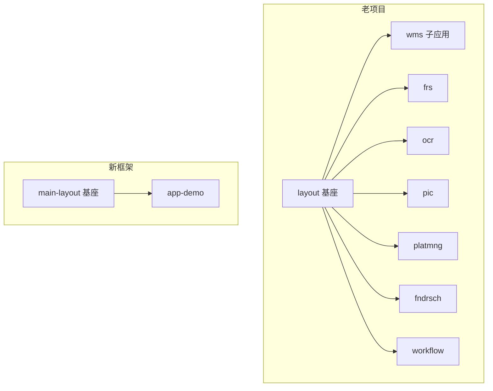
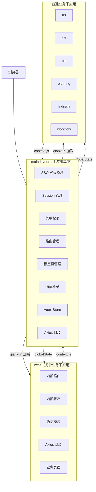
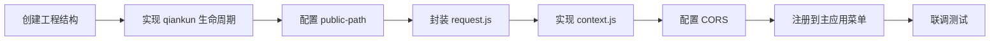
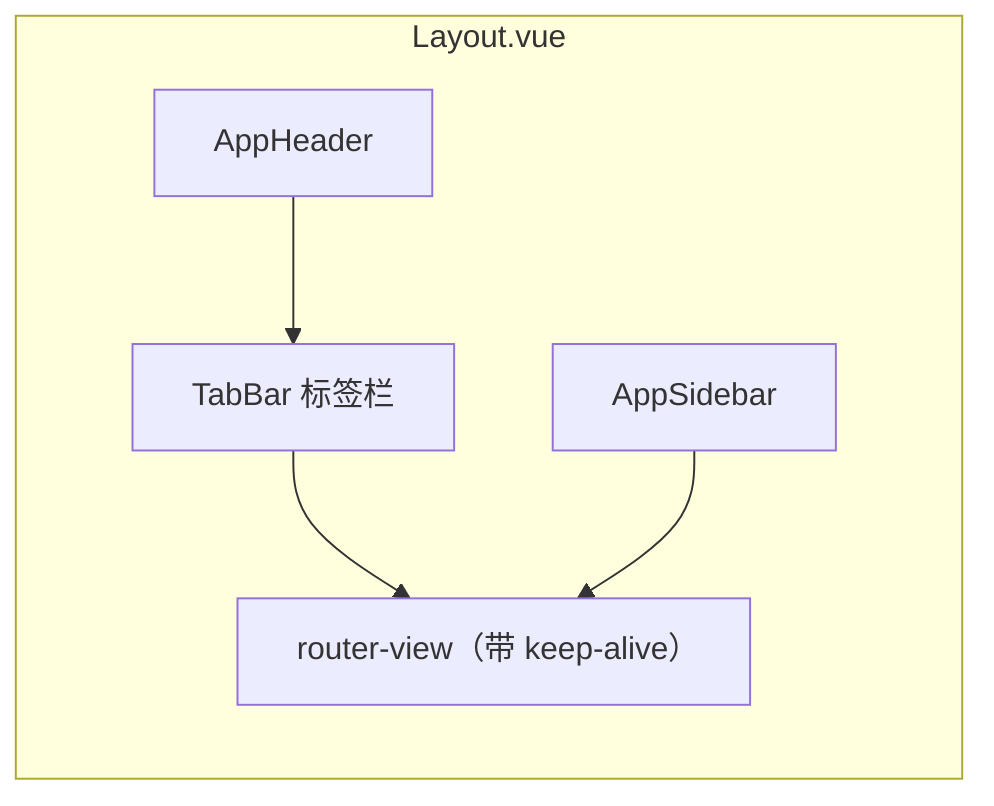
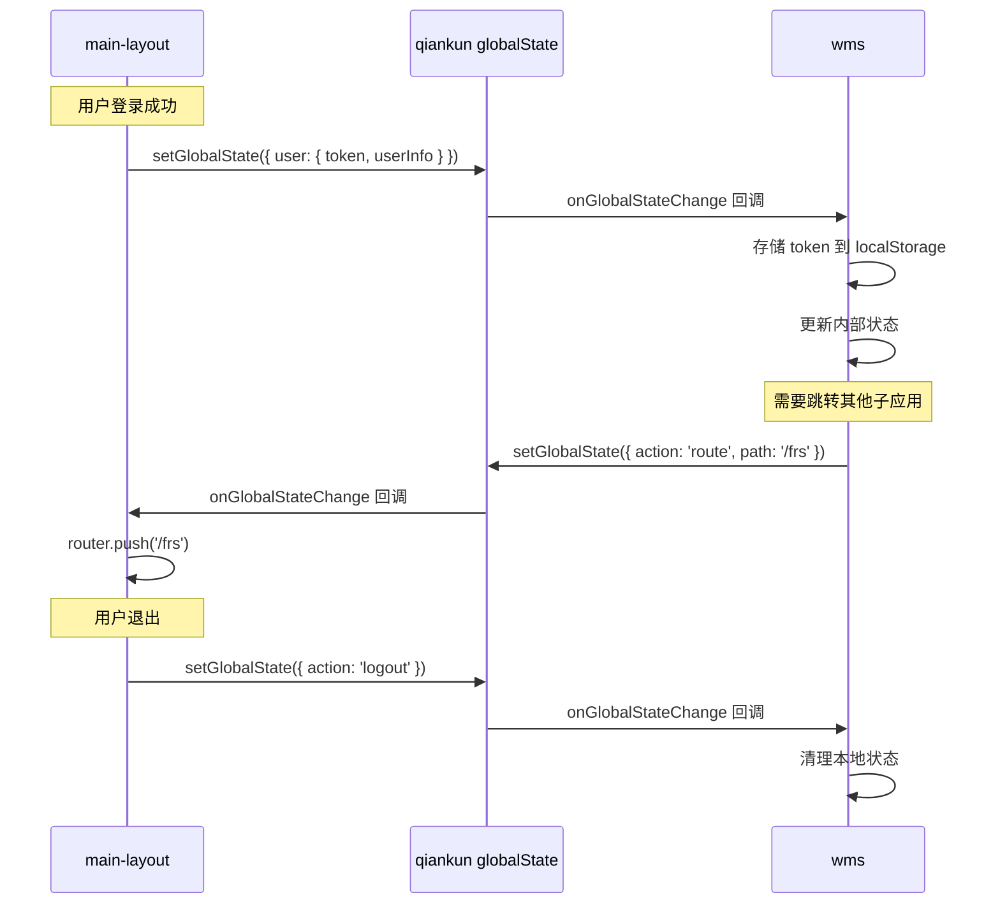
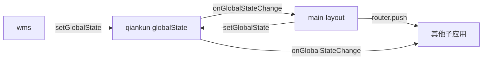
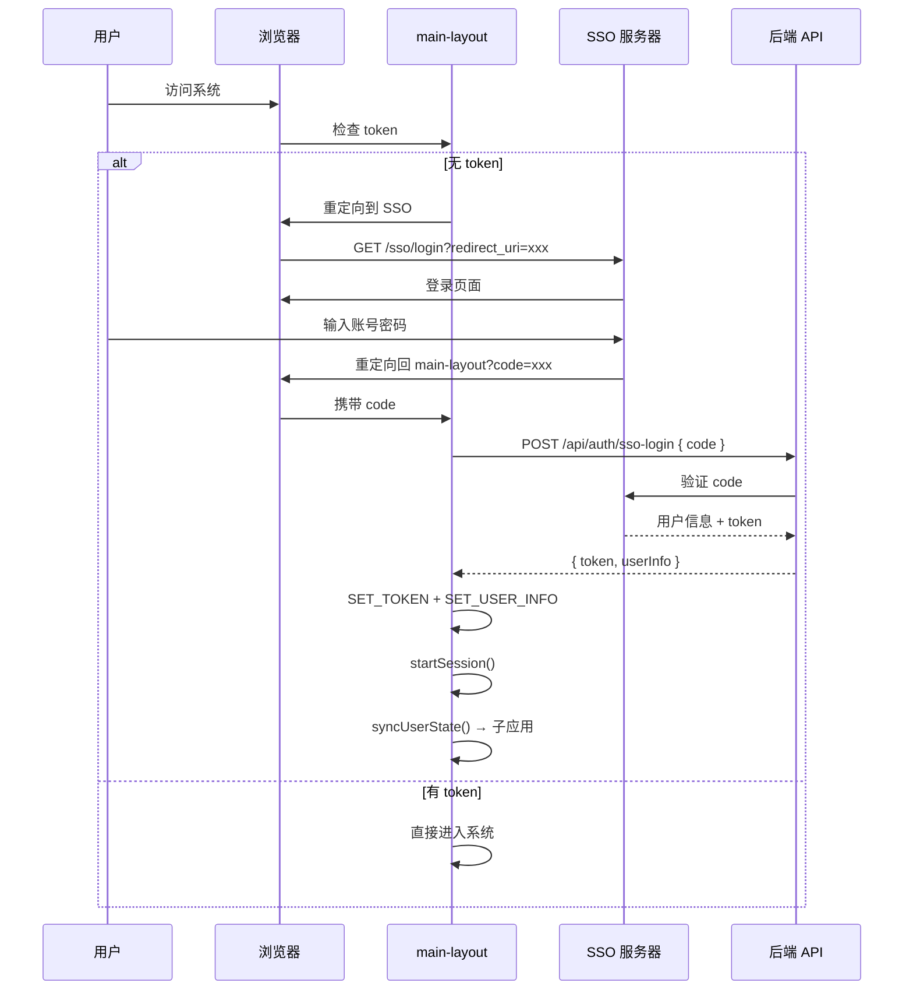
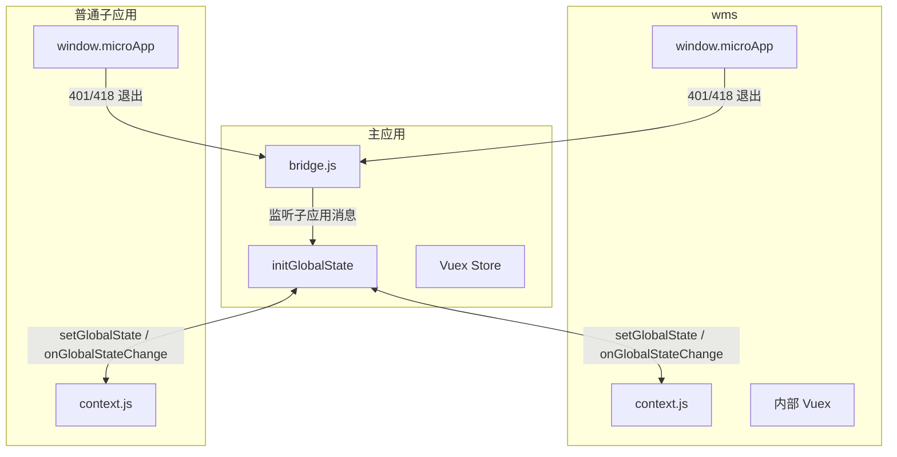
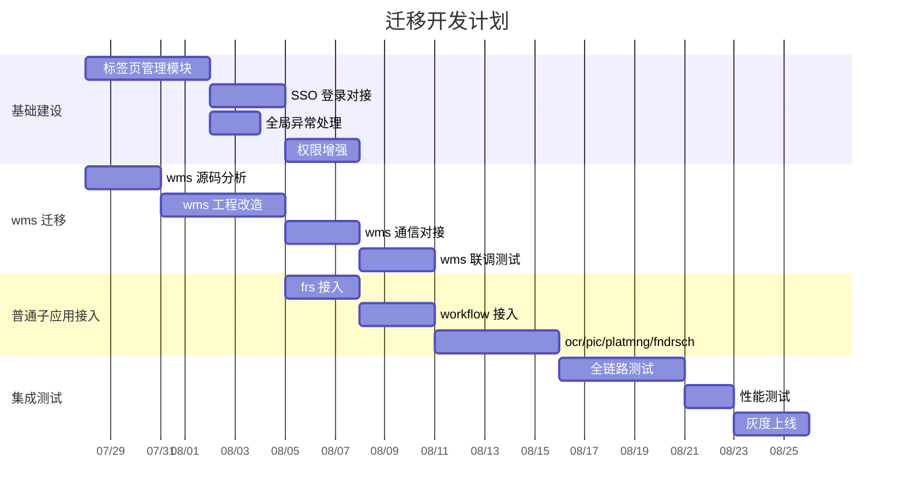

# 前端框架迁移改造方案


> 版本：v1.0
> 日期：2026-07-27
> 面向：技术负责人、开发人员、项目经理


---


# 一、当前新框架架构分析


## 1.1 技术栈


| 类别 | 技术 | 版本 |
|------|------|------|
| 框架 | Vue 2 | ^2.7.16 |
| 路由 | Vue Router | ^3.6.5 |
| 状态管理 | Vuex | ^3.6.2 |
| HTTP | axios | ^1.6.0 |
| 微前端 | qiankun | ^2.10.0 |
| 构建 | Webpack | ^4.46.0 |
| 语言 | JavaScript（ES6+） | - |
| 配置体系 | CommonJS | - |
| Node | 18 | - |


## 1.2 工程组织方式


项目采用 **monorepo 目录结构、独立应用模式**：


```
fmac-front-main/
├── main-layout/          # 主应用（微前端基座）
├── app-demo/             # 子应用示例
├── deploy/
│   └── nginx/            # Nginx 部署配置
├── docs/                 # 项目文档
├── CLAUDE.md             # 执行规范
└── TASK.md               # 任务定义
```


每个应用拥有独立的：
- `package.json`（独立依赖管理）
- `webpack.config.js`（独立构建配置）
- `babel.config.js`（独立 Babel 配置）
- `src/`（独立源码目录）
- `.env.dev / .env.test / .env.prod`（独立环境配置）


应用之间 **禁止源码级引用**，仅通过以下方式交互：
- qiankun 全局状态（initGlobalState）
- HTTP 接口
- 浏览器事件


## 1.3 主应用（main-layout）模块划分


```
main-layout/src/
├── api/                  # API 接口层
│   ├── user.js           # 用户登录、用户信息
│   └── menu.js           # 菜单获取
├── layout/               # 布局组件
│   ├── Layout.vue        # 主布局（Header + Sidebar + Content）
│   ├── AppHeader.vue     # 顶部栏（用户信息、退出按钮）
│   └── AppSidebar.vue    # 侧边栏（动态菜单渲染）
├── micro/                # 微前端核心
│   ├── apps.js           # 子应用注册配置（从菜单数据动态生成）
│   └── globalState.js    # qiankun 全局状态初始化
├── platform/             # 平台能力
│   ├── session.js        # Session 超时检测（30分钟无操作自动退出）
│   └── bridge.js         # 主子应用通信桥梁
├── router/               # 路由
│   ├── index.js          # Vue Router 实例
│   ├── routes.js         # 路由定义
│   └── guards.js         # 路由守卫（权限校验、页面标题）
├── store/                # Vuex 状态管理
│   └── index.js          # token / userInfo / menu / globalState
├── utils/                # 工具函数
│   ├── auth.js           # Token 存取（localStorage）
│   ├── logout.js         # 统一退出流程
│   ├── message.js        # 消息提示
│   └── request.js        # Axios 封装（token 注入、401/418 处理）
├── views/                # 页面
│   ├── Login.vue         # 登录页
│   └── Home.vue          # 首页
├── App.vue               # 根组件
└── main.js               # 入口（qiankun 生命周期）
```


## 1.4 子应用（app-demo）模块划分


```
app-demo/src/
├── api/
│   └── index.js          # 示例 API
├── router/
│   └── index.js          # 独立路由（base 自动适配 qiankun）
├── utils/
│   └── request.js        # 独立 Axios 封装（401/418 → window.microApp.logout）
├── views/
│   ├── Home.vue          # 子应用首页
│   └── About.vue         # 关于页
├── App.vue               # 根组件
├── context.js            # 通信模块（navigateTo / requestRefresh / requestLogout）
├── main.js               # 入口（qiankun 生命周期 + public-path）
└── public-path.js        # 动态 publicPath
```


## 1.5 微前端方案


### 子应用注册


子应用注册数据 **从后端菜单接口动态获取**，而非硬编码：


```javascript
// micro/apps.js
export function getApps() {
  var menu = store.state.menu;
  if (menu && menu.length > 0) {
    return menu
      .filter(function(item) { return item.entry; })
      .map(function(item) {
        return {
          name: item.app_code,
          entry: item.entry,
          container: '#subapp-container',
          activeRule: item.route
        };
      });
  }
  // 降级：默认配置
  return [{ name: 'app-demo', entry: '//localhost:9001', ... }];
}
```


菜单数据结构：


```json
[
  {
    "app_code": "app-demo",
    "app_name": "示例应用",
    "entry": "//localhost:9001",
    "route": "/app-demo",
    "permission": ["view"]
  }
]
```


### 样式隔离


采用 qiankun 的 `experimentalStyleIsolation` 方案。


### 全局状态通信


```
主应用 → 子应用：
  initGlobalState({ user: { token, userInfo }, menu: [], permission: [] })

子应用 → 主应用：
  setGlobalState({ action: 'route', path: '/xxx' })
  setGlobalState({ action: 'refresh' })
  setGlobalState({ action: 'logout' })
```


## 1.6 公共能力建设情况


| 能力 | 状态 | 说明 |
|------|------|------|
| Token 管理 | 已实现 | localStorage 存取 |
| Session 超时 | 已实现 | 30分钟无操作自动退出 |
| Axios 封装 | 已实现 | 各应用独立维护 |
| 401/418 处理 | 已实现 | 主应用直接跳转，子应用通知主应用 |
| 全局状态通信 | 已实现 | initGlobalState |
| 动态子应用注册 | 已实现 | 从菜单数据生成 |
| 路由守卫 | 已实现 | 权限校验 + 页面标题 |
| 消息提示 | 已实现 | 原生 DOM 实现 |
| 退出通知 | 已实现 | bridge 通知所有子应用 |
| 环境配置 | 已实现 | .env.dev / .env.test / .env.prod |
| Nginx 部署 | 已实现 | 多域名 / 单域名两种方案 |


### 当前框架缺失能力（待建设）


| 能力 | 状态 | 说明 |
|------|------|------|
| 标签页管理 | 未实现 | 老项目 layout 有此能力 |
| 页面缓存（keep-alive） | 未实现 | 标签页切换时需要 |
| SSO 对接 | 未实现 | 当前仅有 mock 登录 |
| 权限粒度控制 | 未实现 | 仅有路由级，缺少按钮级 |
| 全局异常上报 | 未实现 | 待确认是否需要 |
| 公共组件库 | 未实现 | 待确认是否需要抽取 |


---


# 二、老项目迁移需求分析


## 2.1 架构对比





## 2.2 老项目 → 新框架能力映射


| 老项目能力 | 新框架现状 | 迁移动作 |
|-----------|-----------|---------|
| **layout: SSO 登录** | 有 mock 登录，无 SSO | 需对接实际 SSO 系统（待确认 SSO 协议） |
| **layout: 登录态维护** | 已实现（localStorage + session 超时） | 可复用，需适配 SSO token 格式 |
| **layout: 用户信息获取** | 已实现（/api/user/info） | 需对接实际接口 |
| **layout: 权限初始化** | 基础实现（路由级） | 需增强为按钮级权限 |
| **layout: 子应用注册** | 已实现（动态菜单驱动） | 可复用，需适配实际菜单数据 |
| **layout: 子应用加载** | 已实现（qiankun） | 可复用 |
| **layout: 生命周期管理** | 已实现（bootstrap/mount/unmount） | 可复用 |
| **layout: 全局异常处理** | 未实现 | 需新增 |
| **layout: 超时检测** | 已实现（30分钟无操作） | 可复用 |
| **layout: token 失效处理** | 已实现（401/418 拦截） | 可复用 |
| **layout: 统一退出** | 已实现（通知子应用） | 可复用 |
| **layout: 子应用通知** | 已实现（bridge + globalState） | 可复用 |
| **layout: 路由管理** | 已实现（Vue Router + guards） | 可复用 |
| **layout: 子应用路由拦截** | 基础实现 | 需增强 |
| **layout: 权限路由控制** | 基础实现 | 需增强 |
| **layout: 标签页管理** | **未实现** | **需新增（重点）** |
| **layout: 标签状态同步** | **未实现** | **需新增（重点）** |
| **layout: 页面缓存** | **未实现** | **需新增（重点）** |


---


# 三、迁移总体方案


## 3.1 总体架构





## 3.2 迁移策略


采用 **渐进式迁移** 策略，分三批接入：


| 批次 | 应用 | 优先级 | 复杂度 | 说明 |
|------|------|--------|--------|------|
| 第一批 | wms | P0 | 高 | 最复杂业务应用，优先验证框架能力 |
| 第二批 | frs、workflow | P1 | 中 | 中等复杂度，验证通用接入流程 |
| 第三批 | ocr、pic、platmng、fndrsch | P2 | 低 | 相对简单的子应用 |


## 3.3 子应用接入标准流程


每个子应用接入新框架需完成以下步骤：





### 接入清单


| 步骤 | 内容 | 产出 |
|------|------|------|
| 1 | package.json + webpack.config.js | 可独立构建 |
| 2 | bootstrap / mount / unmount | qiankun 可加载 |
| 3 | public-path.js | 资源路径正确 |
| 4 | request.js（token 注入 + 401/418） | 请求正常 |
| 5 | context.js（navigateTo / logout） | 通信正常 |
| 6 | CORS 头 | 跨域正常 |
| 7 | 后端菜单配置 entry + route | 自动注册 |


---


# 四、重点迁移方案


## 4.1 标签页管理（新增能力）


老项目 layout 具备标签页管理能力，新框架当前缺失。这是迁移中 **工作量最大** 的新增模块。


### 设计方案





#### 数据结构


```javascript
// store/modules/tabs.js
state: {
  tabs: [
    {
      key: '/home',           // 唯一标识
      title: '首页',          // 标签标题
      path: '/home',          // 路由路径
      closable: true,         // 是否可关闭
      componentName: 'Home'   // 组件名（用于 keep-alive）
    }
  ],
  activeTab: '/home'
}
```


#### 核心功能


| 功能 | 说明 |
|------|------|
| 标签新增 | 路由切换时自动新增标签 |
| 标签关闭 | 点击关闭按钮，切换到相邻标签 |
| 标签切换 | 点击标签跳转对应路由 |
| 右键菜单 | 关闭其他 / 关闭所有 / 刷新 |
| 页面缓存 | 通过 keep-alive + componentName 实现 |


#### 实现要点


```javascript
// Layout.vue 模板
<template>
  <div class="layout">
    <app-header />
    <div class="layout-body">
      <app-sidebar />
      <div class="layout-main">
        <tab-bar />
        <div class="layout-content">
          <keep-alive :include="cachedViews">
            <router-view :key="$route.fullPath" />
          </keep-alive>
        </div>
      </div>
    </div>
  </div>
</template>
```


**注意**：keep-alive 仅对主应用内部页面有效。子应用由 qiankun 管理加载，其内部缓存需子应用自行处理。


## 4.2 wms 子应用迁移（重点）


wms 是复杂业务子应用，迁移难度最高。


### 4.2.1 应用内部通信


| 老项目方式 | 新框架建议 | 说明 |
|-----------|-----------|------|
| 待确认 | Vuex 模块化管理 | 每个功能模块独立 Vuex module |
| 待确认 | EventBus | 轻量级跨组件通信 |
| 待确认 | props/emit | 父子组件通信 |


> **待确认**：wms 老项目的内部通信方式需要分析源码后确定具体迁移策略。


### 4.2.2 跨应用通信方案


#### layout ↔ wms





#### wms ↔ 其他子应用


子应用之间 **不直接通信**，所有跨应用交互通过主应用中转：





通信类型及处理方式：


| 场景 | 方案 |
|------|------|
| 页面跳转 | context.js → setGlobalState({ action: 'route' }) → 主应用路由 |
| 参数传递 | URL query 参数 或 globalState |
| 数据共享 | 通过主应用 Vuex 中转 或 HTTP 接口 |
| 事件通知 | globalState 广播 |


### 4.2.3 wms 接入改造清单


| 改造项 | 说明 | 工作量 |
|--------|------|--------|
| 工程结构标准化 | package.json + webpack.config.js | 中 |
| qiankun 生命周期 | bootstrap / mount / unmount | 低 |
| public-path 动态配置 | __webpack_public_path__ | 低 |
| request.js 封装 | token 注入 + 401/418 → microApp.logout | 中 |
| context.js 通信 | navigateTo / requestLogout / requestRefresh | 中 |
| 路由 base 适配 | 根据 __POWERED_BY_QIANKUN__ 设置 base | 低 |
| 内部状态管理 | 梳理并迁移至 Vuex | 待确认 |
| 跨应用跳转 | 替换为 context.js navigateTo | 中 |
| 独立运行支持 | 非 qiankun 环境下可独立启动 | 中 |


## 4.3 普通业务子应用接入


### 接入分析


| 应用 | 类型 | 接入方式 | 复杂度 |
|------|------|---------|--------|
| frs | 单页面应用 | 标准 qiankun 接入 | 中 |
| ocr | 单页面应用 | 标准 qiankun 接入 | 低 |
| pic | 单页面应用 | 标准 qiankun 接入 | 低 |
| platmng | 单页面应用 | 标准 qiankun 接入 | 低 |
| fndrsch | 单页面应用 | 标准 qiankun 接入 | 低 |
| workflow | 单页面应用 | 标准 qiankun 接入 | 中 |


### 统一接入模板


每个普通子应用按以下模板创建入口文件：


```javascript
// main.js
import './public-path';
import Vue from 'vue';
import App from './App.vue';
import router from './router';
import { setActions, requestLogout } from './context';

Vue.config.productionTip = false;

var instance = null;

function render(props) {
  if (props) {
    setActions({
      onGlobalStateChange: props.onGlobalStateChange,
      setGlobalState: props.setGlobalState
    });
  }
  instance = new Vue({
    router: router,
    render: function(h) { return h(App); }
  }).$mount(
    props && props.container
      ? props.container.querySelector('#app')
      : '#app'
  );
}

if (!window.__POWERED_BY_QIANKUN__) {
  render();
}

window.microApp = { logout: requestLogout };

export async function bootstrap() {}
export async function mount(props) { render(props); }
export async function unmount() {
  if (instance && instance.$el && instance.$el.parentNode) {
    instance.$el.parentNode.removeChild(instance.$el);
  }
  instance.$destroy();
  instance = null;
}
```


### 子应用 request.js 模板


```javascript
// utils/request.js
import axios from 'axios';

var service = axios.create({
  baseURL: process.env.VUE_APP_BASE_API,
  timeout: 15000
});

service.interceptors.request.use(function(config) {
  var token = localStorage.getItem('fmac_token');
  if (token) {
    config.headers['Authorization'] = 'Bearer ' + token;
  }
  return config;
});

service.interceptors.response.use(
  function(response) { return response.data; },
  function(error) {
    if (error.response) {
      var status = error.response.status;
      if (status === 401 || status === 418) {
        if (window.microApp && window.microApp.logout) {
          window.microApp.logout();
        }
      }
    }
    return Promise.reject(error);
  }
);

export default service;
```


---


# 五、SSO 登录对接方案


## 5.1 当前状态


新框架当前使用 mock 登录（/api/user/login），需要对接实际 SSO 系统。


> **待确认**：SSO 协议类型（CAS / OAuth2 / SAML / 自研）。


## 5.2 对接流程（以 OAuth2 为例）





## 5.3 需要改造的文件


| 文件 | 改造内容 |
|------|---------|
| src/views/Login.vue | 增加 SSO 回调处理逻辑 |
| src/router/guards.js | 增加 SSO 重定向判断 |
| src/api/user.js | 增加 SSO token 交换接口 |
| src/utils/auth.js | 适配 token 存储格式（待确认） |


---


# 六、通信方案总设计


## 6.1 通信架构





## 6.2 通信协议


### 主应用 → 子应用


| 字段 | 类型 | 说明 |
|------|------|------|
| user.token | string | 认证令牌 |
| user.userInfo | object | 用户信息 |
| menu | array | 菜单数据 |
| permission | array | 权限列表 |


### 子应用 → 主应用


| action | 附加字段 | 说明 |
|--------|---------|------|
| route | path: string | 请求路由跳转 |
| refresh | - | 请求刷新当前页面 |
| logout | - | 请求退出登录 |


## 6.3 子应用通信模块（context.js）


所有子应用统一使用以下通信模块：


```javascript
// context.js（子应用公共模板）
var actions = null;

export function setActions(a) { actions = a; }
export function getActions() { return actions; }

export function navigateTo(path) {
  if (actions && actions.setGlobalState) {
    actions.setGlobalState({ action: 'route', path: path });
  }
}

export function requestRefresh() {
  if (actions && actions.setGlobalState) {
    actions.setGlobalState({ action: 'refresh' });
  }
}

export function requestLogout() {
  if (actions && actions.setGlobalState) {
    actions.setGlobalState({ action: 'logout' });
  }
}
```


> **建议**：将 context.js 和 request.js 模板抽取为公共 npm 包（如 `@fmac/subapp-sdk`），所有子应用统一引用，降低重复开发成本。


---


# 七、风险分析


## 7.1 技术风险


| 风险 | 等级 | 影响 | 缓解措施 |
|------|------|------|---------|
| wms 内部通信方式不明确 | 高 | 迁移方案可能需调整 | 尽早分析 wms 源码，确认通信方式 |
| SSO 协议对接 | 中 | 登录流程受阻 | 提前确认 SSO 协议，准备对接方案 |
| Webpack4 兼容性 | 低 | 旧依赖可能不兼容 Node 18 | 已验证当前依赖组合可正常工作 |
| 子应用样式冲突 | 中 | 页面显示异常 | 已开启 experimentalStyleIsolation |
| 标签页与子应用缓存 | 中 | 子应用切换时状态丢失 | 子应用内部需自行实现状态持久化 |
| 老项目业务逻辑复杂 | 高 | wms 迁移周期不可控 | 渐进式迁移，先核心后边缘 |


## 7.2 迁移风险


| 风险 | 等级 | 影响 | 缓解措施 |
|------|------|------|---------|
| 老项目文档缺失 | 中 | 需通过源码反推逻辑 | 安排专人分析老项目源码 |
| 业务中断 | 高 | 迁移期间影响用户使用 | 新老系统并行运行，逐步切换 |
| 数据不一致 | 中 | 接口返回格式差异 | 统一接口规范，增加适配层 |


## 7.3 兼容性风险


| 风险 | 等级 | 说明 |
|------|------|------|
| Node 18 + Webpack4 | 低 | 已验证可行 |
| Vue 2.7 + qiankun 2.x | 低 | 成熟组合 |
| 老项目可能使用 Vue 2.5 或更低 | 中 | 需确认老项目 Vue 版本，可能需要小幅升级 |


---


# 八、开发计划


## 8.1 阶段划分





## 8.2 里程碑


| 里程碑 | 目标 | 预计时间 |
|--------|------|---------|
| M1 | 基础建设完成（标签页 + SSO + 异常处理） | 第 2 周 |
| M2 | wms 完成接入并通过联调 | 第 4 周 |
| M3 | 所有普通子应用接入完成 | 第 6 周 |
| M4 | 全链路测试通过，灰度上线 | 第 8 周 |


## 8.3 人力估算


| 阶段 | 工作内容 | 人力 | 工期 |
|------|---------|------|------|
| 基础建设 | 标签页 + SSO + 异常处理 + 权限 | 1 人 | 2 周 |
| wms 迁移 | 源码分析 + 工程改造 + 通信 + 联调 | 2 人 | 3 周 |
| 普通子应用 | 6 个子应用标准化接入 | 1-2 人 | 2 周 |
| 测试验收 | 全链路 + 性能 + 灰度 | 1 人 | 1.5 周 |


总工期预估：**7~8 周**（含缓冲）。


---


# 九、待确认事项


以下事项需要进一步调研或与相关方确认后补充：


| 编号 | 事项 | 影响范围 | 当前假设 |
|------|------|---------|---------|
| 1 | SSO 协议类型（CAS/OAuth2/SAML/自研） | 登录模块 | 假设 OAuth2 |
| 2 | wms 老项目技术栈（Vue 版本？jQuery？） | wms 迁移方案 | 假设 Vue 2.x |
| 3 | wms 内部通信方式 | wms 迁移方案 | 假设 Vuex + EventBus |
| 4 | wms 是否有直接操作 DOM 或全局变量 | 样式隔离 | 需排查 |
| 5 | 后端接口是否已统一 | 所有子应用 | 假设已有统一网关 |
| 6 | 老项目是否有自动化测试 | 迁移验证 | 假设无 |
| 7 | 普通子应用当前技术栈 | 接入方式 | 待确认 |
| 8 | 是否需要公共组件库 | 开发效率 | 建议后续建设 |
| 9 | 部署环境（内网/公网/混合） | Nginx 配置 | 假设内网 |
| 10 | 标签页是否需要跨应用保持 | 架构设计 | 假设仅主应用内部标签 |


---


# 十、总结


## 10.1 新框架优势


1. **标准化工程结构**：每个应用独立构建、独立部署、独立运行。
2. **成熟的微前端方案**：qiankun 已验证，支持动态注册、样式隔离、全局通信。
3. **完善的基座能力**：登录、session、菜单、路由、axios 封装已就绪。
4. **可扩展的通信机制**：globalState 支持双向通信，协议清晰。


## 10.2 迁移核心工作


1. **新增标签页管理**（工作量最大）
2. **对接 SSO 登录**（依赖后端配合）
3. **wms 复杂业务迁移**（依赖源码分析）
4. **6 个普通子应用标准化接入**（模板化，可批量推进）


## 10.3 建议


1. 优先分析 wms 老项目源码，确认技术栈和通信方式。
2. 尽早确认 SSO 协议，准备对接。
3. 将 context.js 和 request.js 模板抽取为公共包 `@fmac/subapp-sdk`。
4. 新老系统并行运行，灰度切换，降低业务中断风险。
5. 标签页管理模块设计时预留扩展点，后续可支持更多定制。
