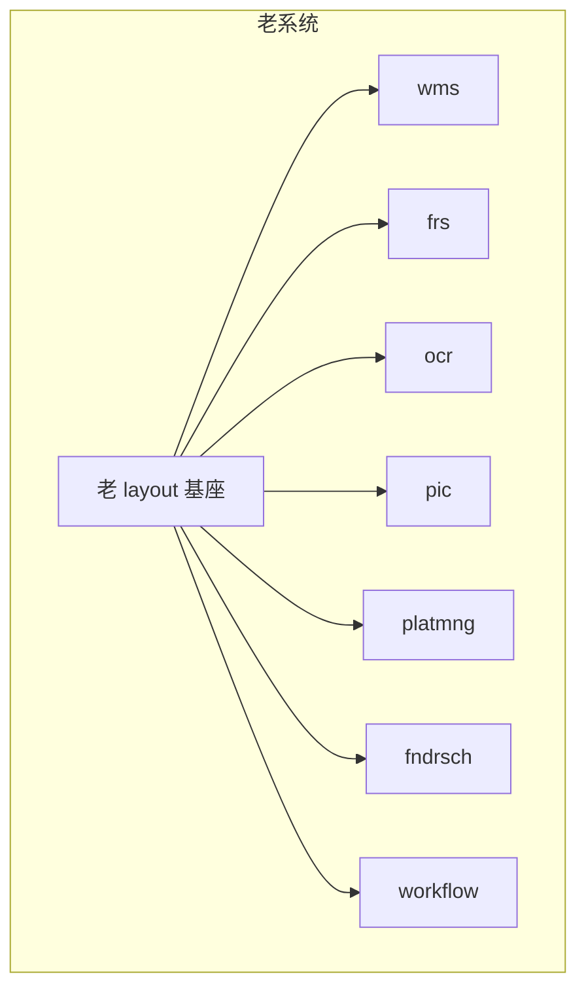
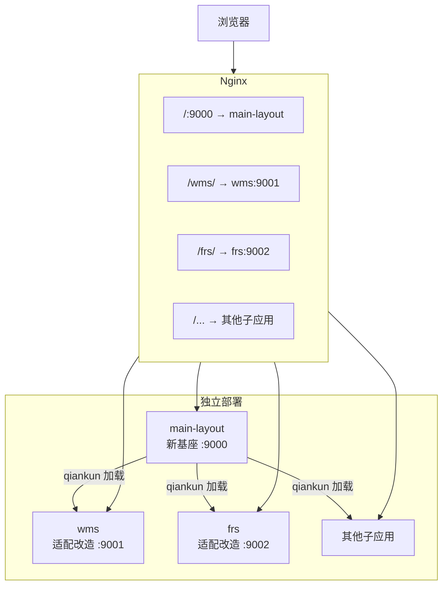
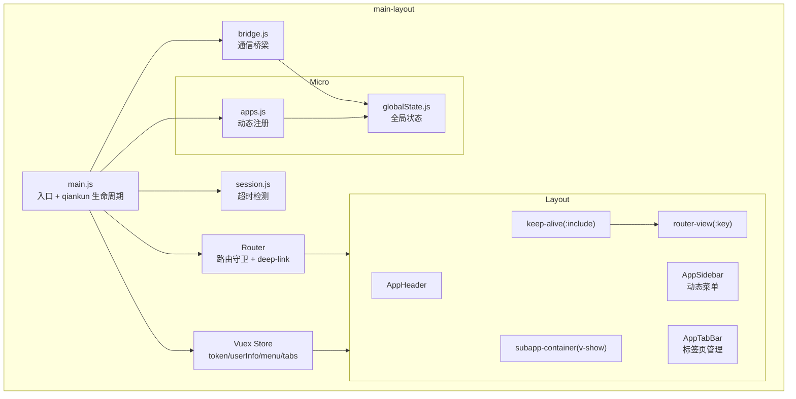
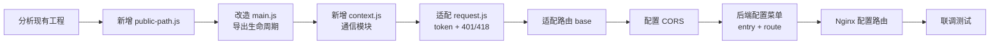

# 设计文档

> 项目名称：fmac-front-main 企业级 qiankun 微前端脚手架
> 版本：v1.0
> 日期：2026-08-26

---

# 1. 设计目标

本设计文档基于需求文档定义的项目需求，解决以下核心问题：

1. **如何构建微前端基座**：用 main-layout 替换老 layout，提供统一的微前端管理能力
2. **如何实现子应用隔离**：通过 qiankun 实现样式隔离和 JS 沙箱，消除冲突
3. **如何建立通信机制**：通过 qiankun globalState 实现主子应用双向通信
4. **如何实现企业级 Layout**：标签页管理、页面缓存、持久化恢复
5. **如何标准化子应用接入**：制定统一适配规范，降低接入成本
6. **如何实现平滑迁移**：渐进式接入，新老系统并行运行
7. **如何支持独立部署**：各应用独立构建，Nginx 路由分发

---

# 2. 总体架构

## 2.1 架构演进

```
现有架构（老系统）
    ↓  替换基座
迁移方案（main-layout 新基座 + 子应用适配）
    ↓  逐步接入
目标架构（完整的 qiankun 微前端体系）
```

## 2.2 现有架构

老系统采用传统架构，layout 基座直接管理所有子应用：



问题：子应用无隔离、基座耦合严重、缺乏标签页和缓存能力、构建部署不统一。

## 2.3 目标架构

新架构采用 qiankun 微前端，main-layout 作为基座替换老 layout：



## 2.4 基座内部架构



## 2.5 关键技术组件关系

| 组件 | 职责 | 依赖 |
|------|------|------|
| main.js | 应用入口，qiankun 生命周期，启动时恢复标签 | Router, Store, Bridge, Session, Apps |
| Layout.vue | 主布局容器，管理 keep-alive 和子应用容器 | AppTabBar, Router, Store |
| AppTabBar.vue | 标签栏 UI，拖拽排序，双击关闭，右键菜单 | Store(tabs) |
| AppSidebar.vue | 侧边栏，动态渲染菜单 | Store(menu) |
| router/guards.js | 路由守卫，权限校验，标签创建，持久化 | Store(tabs), Store(token) |
| store/tabs.js | 标签页状态管理，持久化，缓存控制 | localStorage |
| store/index.js | 根 Store，集成所有模块 | Vuex |
| platform/bridge.js | 通信桥梁，状态同步，事件监听 | GlobalState, Store |
| platform/session.js | Session 超时检测 | logout |
| micro/apps.js | 子应用动态注册 | Store(menu) |
| micro/globalState.js | qiankun 全局状态初始化 | qiankun |

---

# 3. 技术方案

## 3.1 微前端框架：qiankun 2.x

**为什么选择**：
- 基于 single-spa，成熟稳定
- 支持 Vue 2 + Webpack 4 技术栈
- 提供 JS 沙箱和样式隔离
- 支持应用间通信（initGlobalState）
- 社区活跃，文档完善

**解决什么问题**：
- 子应用之间的隔离（样式、JS 全局变量）
- 子应用的独立开发和部署
- 子应用的生命周期管理

**如何实现**：
- `registerMicroApps`：从后端菜单数据动态生成子应用配置
- `start`：启动 qiankun，开启 experimentalStyleIsolation
- `initGlobalState`：建立主子应用双向通信

**与现有方案的区别**：
- 老系统无隔离，子应用共享全局环境
- 新方案通过 qiankun 沙箱实现隔离

**风险**：
- experimentalStyleIsolation 对部分第三方库样式可能不兼容
- 子应用直接操作 document 可能绕过沙箱

**替代方案**：
- 项目约束仅使用 qiankun，不考虑其他微前端框架

## 3.2 框架：Vue 2.7.x

**为什么选择**：
- 项目固定约束，各子应用均基于 Vue 2
- Vue 2.7 是 Vue 2 的最终版本，包含 Composition API 回移
- 生态成熟，与 Webpack 4 兼容良好

**解决什么问题**：
- 提供响应式数据绑定和组件化开发
- keep-alive 组件实现页面缓存

**风险**：
- Vue 2 已于 2023 年底 EOL，不再接收新功能
- 部分新库不再支持 Vue 2

## 3.3 构建工具：Webpack 4.47.x

**为什么选择**：
- 项目固定约束，各子应用均使用 Webpack 4
- 与 Vue 2 生态兼容良好
- 团队熟悉

**解决什么问题**：
- 提供 Vue SFC 编译、Babel 转译、CSS 处理、静态资源管理
- 支持开发服务器（webpack-dev-server）和热更新

**风险**：
- Webpack 4 生态已停止维护
- 部分新 loader/plugin 不兼容 Webpack 4（如 style-loader@3.x、css-loader@6.x 要求 Webpack 5）
- 已验证解决方案：使用 style-loader@2.x 和 css-loader@5.x

## 3.4 状态管理：Vuex 3.x

**为什么选择**：
- 与 Vue 2 配套
- 模块化设计，适合管理复杂状态

**解决什么问题**：
- 管理 token、userInfo、menu、tabs 等全局状态
- tabs 模块独立管理标签页状态

**实现方式**：
- 根 Store 包含 token/userInfo/menu 状态
- tabs 模块（store/tabs.js）管理标签页状态（visitedViews、cachedViews）
- 标签页模块合并到根 Store

## 3.5 通信方案：qiankun globalState

**为什么选择**：
- qiankun 内置能力，无需引入额外依赖
- 支持双向通信
- API 简洁（setGlobalState / onGlobalStateChange）

**解决什么问题**：
- 基座向子应用同步 token、userInfo、menu、permission
- 子应用向基座发送路由跳转、刷新、退出、标签管理等指令

**实现方式**：
- 基座侧：`micro/globalState.js` 封装 initGlobalState，`platform/bridge.js` 封装通信方法
- 子应用侧：`context.js` 封装通信方法，mount 时存储 actions

**风险**：
- globalState 不适合传递大量数据
- 子应用之间不能直接通信，必须通过基座中转

**替代方案**：
- CustomEvent：更轻量但缺乏状态管理能力
- 共享 URL 参数：不适合频繁通信

## 3.6 标签页管理方案

**为什么选择自定义实现**：
- 基于 Vuex + Vue Router 的 afterEach 钩子
- 与 keep-alive 深度集成
- 支持主子应用标签事件同步

**解决什么问题**：
- 企业级标签页浏览体验
- 页面缓存和状态保持
- 浏览器刷新后恢复工作状态

**实现方式**：
- `store/tabs.js`：标签状态管理（增删改查、持久化、缓存控制）
- `AppTabBar.vue`：标签栏 UI（拖拽排序、双击关闭、右键菜单）
- `router/guards.js`：路由切换自动创建标签
- `platform/bridge.js`：子应用标签事件处理

**与现有方案的区别**：
- 老系统无标签页管理能力
- 新方案提供完整的标签页管理，包括持久化和恢复

## 3.7 部署方案：Nginx 路由分发

**为什么选择**：
- 项目已有 Nginx 部署经验
- 支持多域名和单域名两种方案

**解决什么问题**：
- 各应用独立部署
- 请求路由分发
- 静态资源缓存

**实现方式**：
- 多域名方案：各应用独立域名
- 单域名方案：共用域名，路径区分
- 静态资源长缓存（js/css 30天）

---

# 4. 核心模块设计

## 4.1 微前端核心模块（micro/）

### 4.1.1 apps.js — 子应用动态注册

- **模块职责**：从后端菜单数据动态生成 qiankun 子应用配置
- **输入**：Vuex store 中的 menu 数据
- **输出**：qiankun registerMicroApps 所需的子应用配置数组
- **核心逻辑**：
  1. 从 store.state.menu 获取菜单数据
  2. 过滤有 entry 字段的菜单项
  3. 映射为 `{ name, entry, container, activeRule }` 格式
- **依赖关系**：依赖 store(menu)
- **与其他模块的关系**：main.js 调用 getApps() 获取配置后注册

### 4.1.2 globalState.js — 全局状态初始化

- **模块职责**：封装 qiankun initGlobalState
- **输入**：初始状态（token、userInfo、menu、permission）
- **输出**：actions 对象（setGlobalState、onGlobalStateChange）
- **核心逻辑**：调用 qiankun initGlobalState 创建全局状态实例
- **依赖关系**：依赖 qiankun
- **与其他模块的关系**：bridge.js 使用 actions 进行通信

## 4.2 平台能力模块（platform/）

### 4.2.1 bridge.js — 通信桥梁

- **模块职责**：封装主子应用双向通信
- **输入**：globalState actions
- **输出**：syncUserState、syncMenuState、notifyLogout、initBridge 方法
- **核心逻辑**：
  - syncUserState：调用 setGlobalState 同步 token 和 userInfo
  - syncMenuState：调用 setGlobalState 同步菜单数据
  - notifyLogout：通知子应用退出
  - initBridge：监听 onGlobalStateChange，处理 route/refresh/logout/TAB_OPEN/TAB_CLOSE/TAB_REFRESH 指令
- **依赖关系**：依赖 globalState、store、router
- **与其他模块的关系**：main.js 初始化时调用 initBridge

### 4.2.2 session.js — Session 超时检测

- **模块职责**：检测用户操作状态，超时自动退出
- **输入**：用户交互事件（mousemove/keydown/click）
- **输出**：超时后调用 logout
- **核心逻辑**：
  1. 监听 mousemove/keydown/click 事件
  2. 每次交互重置活跃时间
  3. 定时检测是否超过 30 分钟
  4. 超时后调用统一退出流程
- **依赖关系**：依赖 logout
- **与其他模块的关系**：main.js 启动时调用 startSession

## 4.3 路由模块（router/）

### 4.3.1 guards.js — 路由守卫

- **模块职责**：权限校验、页面标题、标签创建、持久化、deep-link 保存
- **输入**：路由跳转事件
- **输出**：拦截/放行、标签创建、持久化保存
- **核心逻辑**：
  - beforeEach：检查 token，无 token 保存 redirect 并跳转登录页
  - afterEach：设置 document.title，dispatch addTab，persistTabs，清除残留 redirect
- **依赖关系**：依赖 store(token)、store(tabs)、auth.js
- **与其他模块的关系**：router/index.js 注册守卫

### 4.3.2 routes.js — 路由定义

- **模块职责**：定义所有路由规则
- **输入**：无
- **输出**：路由配置数组
- **核心逻辑**：
  - `/login`：登录页（无 Layout）
  - `/`：Layout 包裹，子路由 `/home`（首页）
  - 子应用路由：标记 isSubApp: true
  - `*`：重定向到 `/home`
- **依赖关系**：依赖 Layout.vue、Login.vue、Home.vue
- **与其他模块的关系**：router/index.js 使用路由配置

## 4.4 状态管理模块（store/）

### 4.4.1 index.js — 根 Store

- **模块职责**：管理 token、userInfo、menu、globalState 状态
- **输入**：API 响应数据
- **输出**：状态数据供各组件使用
- **核心逻辑**：
  - SET_TOKEN / SET_USER_INFO / SET_MENU mutations
  - 集成 tabs 模块
- **依赖关系**：依赖 tabs.js 模块
- **与其他模块的关系**：被各组件和模块引用

### 4.4.2 tabs.js — 标签页状态管理

- **模块职责**：标签页的增删改查、持久化、缓存控制
- **输入**：路由信息、标签操作指令
- **输出**：visitedViews（标签列表）、cachedViews（缓存列表）
- **核心逻辑**：
  - addTab：创建标签，更新 cachedViews
  - closeTab：关闭标签，清理缓存，跳转相邻标签
  - refreshTab：移除缓存 → viewKey++ → 恢复缓存
  - reorderTabs：拖拽排序
  - persistTabs：序列化保存到 localStorage
  - restoreTabs：启动时从 localStorage 恢复
  - saveRedirect / getRedirect：deep-link 保存和恢复
- **依赖关系**：依赖 localStorage
- **与其他模块的关系**：guards.js 调用 addTab/persistTabs，AppTabBar 调用 closeTab/refreshTab/reorderTabs

## 4.5 布局模块（layout/）

### 4.5.1 Layout.vue — 主布局

- **模块职责**：管理整体布局结构（Header + Sidebar + TabBar + Content）
- **输入**：路由状态、标签页状态
- **输出**：布局 UI
- **核心逻辑**：
  - 集成 AppHeader、AppSidebar、AppTabBar
  - keep-alive 包裹 router-view（:include="cachedViews"）
  - 主应用页面（keepAlive: true）参与缓存，子应用页面（isSubApp: true）不参与 keep-alive 缓存
  - subapp-container 用于子应用渲染（v-show 控制可见性）
  - isSubAppRoute 判断当前是否为子应用路由
  - v-if / v-show 互斥：主应用页面（keep-alive + router-view）和子应用容器不同时渲染
- **依赖关系**：依赖 store(tabs)、router
- **与其他模块的关系**：被 routes.js 引用为父路由组件

### 4.5.2 AppTabBar.vue — 标签栏

- **模块职责**：标签页 UI 和交互
- **输入**：visitedViews 列表
- **输出**：标签栏 UI，支持拖拽排序、双击关闭、右键菜单
- **核心逻辑**：
  - 渲染标签列表
  - 点击标签 → router.push
  - 拖拽排序 → dragstart/dragover/drop → reorderTabs
  - 双击关闭 → dblClickClose
  - 右键菜单 → 6 种操作
- **依赖关系**：依赖 store(tabs)
- **与其他模块的关系**：嵌入 Layout.vue

### 4.5.3 AppSidebar.vue — 侧边栏

- **模块职责**：动态渲染菜单
- **输入**：store(menu) 菜单数据
- **输出**：菜单 UI
- **核心逻辑**：遍历菜单数据渲染菜单项，点击跳转路由
- **依赖关系**：依赖 store(menu)

### 4.5.4 AppHeader.vue — 顶部栏

- **模块职责**：展示用户信息和退出按钮
- **输入**：store(userInfo)
- **输出**：顶部栏 UI
- **核心逻辑**：显示用户名、角色，提供退出按钮
- **依赖关系**：依赖 store(userInfo)、logout.js

## 4.6 工具模块（utils/）

### 4.6.1 auth.js — Token 管理

- **模块职责**：token 的存取
- **输入/输出**：getToken / setToken / removeToken
- **核心逻辑**：封装 localStorage 操作，key 为 fmac_token

### 4.6.2 request.js — Axios 封装

- **模块职责**：统一 HTTP 请求
- **输入**：请求配置
- **输出**：响应数据
- **核心逻辑**：
  - 请求拦截：注入 Bearer token
  - 响应拦截：401 清除 token 跳转登录页，418 强制退出，网络异常消息提示
- **依赖关系**：依赖 auth.js、logout.js、message.js

### 4.6.3 logout.js — 统一退出

- **模块职责**：协调退出流程
- **输入**：无
- **输出**：清除状态，跳转登录页
- **核心逻辑**：清除 token → 停止 session → 通知子应用退出 → 跳转登录页
- **依赖关系**：依赖 auth.js、session.js、bridge.js

### 4.6.4 message.js — 消息提示

- **模块职责**：统一消息提示
- **输入**：消息内容和类型
- **输出**：UI 提示

---

# 5. 工程结构设计

## 5.1 项目总体结构

```
fmac-front-main/
├── main-layout/              # 主应用（微前端基座）
│   ├── src/
│   │   ├── api/              # API 接口层
│   │   │   ├── user.js       # 用户登录、用户信息
│   │   │   └── menu.js       # 菜单获取
│   │   ├── layout/           # 布局组件
│   │   │   ├── Layout.vue    # 主布局（Header + Sidebar + TabBar + Content）
│   │   │   ├── AppHeader.vue # 顶部栏
│   │   │   ├── AppSidebar.vue # 侧边栏
│   │   │   └── AppTabBar.vue # 标签页栏
│   │   ├── micro/            # 微前端核心
│   │   │   ├── apps.js       # 子应用注册配置
│   │   │   └── globalState.js # 全局状态初始化
│   │   ├── platform/         # 平台能力
│   │   │   ├── session.js    # Session 超时检测
│   │   │   └── bridge.js     # 通信桥梁
│   │   ├── router/           # 路由
│   │   │   ├── index.js      # Vue Router 实例
│   │   │   ├── routes.js     # 路由定义
│   │   │   └── guards.js     # 路由守卫
│   │   ├── store/            # Vuex 状态管理
│   │   │   ├── index.js      # 根 Store
│   │   │   └── tabs.js       # 标签页状态管理
│   │   ├── utils/            # 工具函数
│   │   │   ├── auth.js       # Token 存取
│   │   │   ├── logout.js     # 统一退出
│   │   │   ├── message.js    # 消息提示
│   │   │   └── request.js    # Axios 封装
│   │   ├── views/            # 页面
│   │   │   ├── Login.vue     # 登录页
│   │   │   └── Home.vue      # 首页
│   │   ├── App.vue           # 根组件
│   │   └── main.js           # 入口
│   ├── mock/                 # Mock 数据
│   │   └── index.js
│   ├── public/               # 静态资源
│   │   └── index.html
│   ├── .env.dev              # 开发环境配置
│   ├── .env.test             # 测试环境配置
│   ├── .env.prod             # 生产环境配置
│   ├── babel.config.js       # Babel 配置
│   ├── package.json
│   └── webpack.config.js     # Webpack 配置
│
├── app-demo/                 # 子应用示例
│   ├── src/
│   │   ├── api/              # API 接口
│   │   ├── router/           # 路由
│   │   ├── utils/            # 工具函数
│   │   ├── views/            # 页面
│   │   ├── context.js        # [适配] 通信模块
│   │   ├── public-path.js    # [适配] 动态资源路径
│   │   ├── App.vue
│   │   └── main.js           # [适配] 入口（含 qiankun 生命周期）
│   ├── mock/
│   ├── public/
│   ├── .env.dev / .env.test / .env.prod
│   ├── babel.config.js
│   ├── package.json
│   └── webpack.config.js     # [适配] dev-server CORS
│
├── deploy/
│   └── nginx/                # Nginx 配置
│       ├── fmac-multi-domain.conf
│       └── fmac-single-domain.conf
│
└── docs/                     # 项目文档
```

## 5.2 子应用适配后的工程结构

```
子应用工程（保留原有结构，仅新增/改动标记 [新增] 或 [改造] 的文件）
├── src/
│   ├── ...                     # 原有业务代码（不动）
│   ├── public-path.js          # [新增] 动态 publicPath
│   ├── context.js              # [新增] 与基座通信模块
│   ├── main.js                 # [改造] 导出 qiankun 生命周期
│   └── utils/
│       └── request.js          # [改造] 适配 token 规范 + 401/418
├── webpack.config.js           # [改造] dev-server 添加 CORS
└── package.json                # [可选] 无需新增依赖
```

## 5.3 代码规范

- 所有 Node 配置文件（webpack.config.js、babel.config.js）使用 CommonJS（module.exports）
- 禁止在配置文件中使用 ES Module（export default）
- JavaScript 源码使用 ES6+ 语法
- 禁止使用 Vue 3、Webpack 5、TypeScript
- 禁止使用其他微前端框架（仅 qiankun）

---

# 6. 构建与运行设计

## 6.1 开发环境

### 6.1.1 环境要求

- Node.js 18
- npm

### 6.1.2 开发启动

**主应用**：

```bash
cd main-layout
npm install
npm run serve
# 访问 http://localhost:9000
```

**子应用**：

```bash
cd app-demo
npm install
npm run serve
# 访问 http://localhost:9001
```

### 6.1.3 开发流程

1. 启动主应用（端口 9000）
2. 启动子应用（端口 9001）
3. 在主应用中访问 `/app-demo` 路径加载子应用
4. 各应用独立开发调试

## 6.2 构建流程

### 6.2.1 编译流程

```
源码（Vue SFC + JS + CSS）
    ↓
Webpack 4 编译
    ├── vue-loader：编译 .vue 文件
    ├── babel-loader：ES6+ → ES5
    ├── css-loader + style-loader：处理 CSS
    └── file-loader / url-loader：处理静态资源
    ↓
产物（dist/）
    ├── index.html
    ├── js/
    ├── css/
    └── img/
```

### 6.2.2 构建命令

**主应用**：

```bash
cd main-layout
npm run build        # 使用 .env.prod
npm run build:dev    # 使用 .env.dev
```

**子应用**：

```bash
cd app-demo
npm run build
```

### 6.2.3 环境变量注入

构建时通过 `--env` 参数选择环境配置文件：

- `.env.dev`：开发环境（VUE_APP_BASE_API 指向开发后端）
- `.env.test`：测试环境
- `.env.prod`：生产环境

配置项通过 `process.env.VUE_APP_*` 在代码中访问。

## 6.3 运行时加载

### 6.3.1 主应用启动流程

```
main.js 执行
    ↓
创建 Vue 实例
    ↓
恢复标签页（restoreTabs，token 存在时）
    ↓
初始化 qiankun 全局状态（initGlobalState）
    ↓
初始化通信桥梁（initBridge）
    ↓
启动 Session 超时检测（startSession）
    ↓
注册子应用（registerMicroApps）
    ↓
启动 qiankun（start）
    ↓
应用就绪，等待用户操作
```

### 6.3.2 子应用加载流程

```
用户访问子应用路由（如 /app-demo）
    ↓
qiankun 匹配 activeRule
    ↓
fetch 子应用 entry（HTML）
    ↓
解析 JS/CSS 资源
    ↓
调用 bootstrap 生命周期
    ↓
调用 mount 生命周期
    ├── 接收 props（onGlobalStateChange、setGlobalState、container）
    ├── 存储 actions 到 context.js
    ├── 创建 Vue 实例
    └── 挂载到 container 内的 #app
    ↓
子应用渲染完成
```

### 6.3.3 子应用卸载流程

```
用户离开子应用路由
    ↓
qiankun 调用 unmount 生命周期
    ↓
销毁 Vue 实例（instance.$destroy()）
    ↓
移除 DOM 节点
    ↓
清理引用（instance = null）
```

## 6.4 发布流程

1. 构建：`npm run build`
2. 上传 dist 目录到服务器
3. 配置 Nginx（选择多域名或单域名方案）
4. 重载 Nginx：`nginx -s reload`

## 6.5 新旧方案兼容方式

- 新老系统通过不同域名或路径并行运行
- 后端菜单接口配置子应用 entry 指向新基座或老 layout
- 灰度切换：逐步将子应用 entry 从老 layout 切换到 main-layout
- 回退方案：修改 entry 指回老 layout 即可

---

# 7. 兼容性设计

## 7.1 新旧框架兼容

| 维度 | 兼容方案 |
|------|---------|
| Vue 版本 | 基座使用 Vue 2.7.x，子应用保持原有 Vue 2.x 版本 |
| Webpack 版本 | 基座使用 Webpack 4.47.x，子应用保持原有 Webpack 版本 |
| 路由 | 基座使用 Vue Router 3.x（history 模式），子应用路由 base 动态切换 |
| 状态管理 | 基座使用 Vuex 3.x，子应用保持原有状态管理方案 |

## 7.2 新旧构建工具兼容

| 维度 | 兼容方案 |
|------|---------|
| style-loader | 基座使用 2.x（兼容 Webpack 4），避免使用 3.x |
| css-loader | 基座使用 5.x（兼容 Webpack 4），避免使用 6.x |
| vue-loader | 使用 15.x（兼容 Vue 2 + Webpack 4） |
| babel-loader | 使用 8.x + @babel/preset-env |

## 7.3 Babel 兼容

- 使用 `@babel/preset-env` 转译 ES6+ 语法
- 支持 Vue SFC 编译
- 配置体系使用 CommonJS（babel.config.js 使用 module.exports）

## 7.4 Node.js 兼容

- 固定使用 Node.js 18
- 所有依赖需验证与 Node 18 的兼容性
- 已验证：Webpack 4.47.0 + Vue 2.7.x + qiankun 2.x 在 Node 18 下正常工作

## 7.5 微前端兼容

### 7.5.1 qiankun 与子应用兼容

- 子应用需导出 bootstrap/mount/unmount 生命周期
- 子应用需设置动态 `__webpack_public_path__`
- 子应用 dev-server 需返回 CORS 头
- 子应用路由 base 需根据运行环境动态设置

### 7.5.2 样式隔离兼容

- 开启 `experimentalStyleIsolation`
- 子应用内使用 scoped CSS 或 CSS Modules 可增强隔离效果
- 第三方组件库的全局样式可能需额外处理

### 7.5.3 JS 沙箱兼容

- qiankun 提供 ProxySandbox（默认）和 SnapshotSandbox
- 子应用对 window 的读写被沙箱拦截
- 子应用如有全局变量使用，需排查并封装到模块内

## 7.6 公司内部框架/公共能力兼容

- 子应用适配不改变原有业务代码
- 子应用原有公共能力（如内部组件库）保持不变
- 通信通过 context.js 统一封装，不侵入业务逻辑

## 7.7 安全性设计

基于需求文档 7.6 的安全性需求，本项目在安全性方面的设计如下：

### 7.7.1 Token 安全

- token 存储在 localStorage（key: fmac_token），通过 Authorization header 传递
- 退出时立即清除 token，防止残留被利用
- 子应用通过统一的 auth.js 存取 token，避免分散管理

> 待确认：是否需要将 token 迁移到 httpOnly cookie 以增强安全性。

### 7.7.2 Session 安全

- 30分钟无操作自动退出，降低未授权访问风险
- 退出时清除所有认证状态（token、userInfo）
- 通知所有子应用同步退出

### 7.7.3 权限控制

- 当前实现路由级守卫（beforeEach 校验 token）
- 后续可扩展为按钮级权限（基于 permission 数据）

### 7.7.4 SSO 对接安全

- SSO 对接时需验证回调 URL 合法性，防止 open redirect
- token 交换需通过后端 API，不在前端直接处理

> 注：项目资料中未涉及 XSS、CSRF、CSP 等安全策略的具体要求。后续可根据实际安全评估补充相应防护措施。

## 7.8 性能设计

基于需求文档 7.2 的性能需求，本项目在性能方面的设计考虑如下：

### 7.8.1 构建性能

- Webpack 4 构建使用 babel-loader 缓存（cacheDirectory）
- 开发模式使用 development 构建，减少优化步骤
- 生产模式使用 production 构建，启用代码压缩

### 7.8.2 开发启动速度

- webpack-dev-server 提供热更新，避免全量刷新
- 各应用独立启动，不相互阻塞
- Mock 数据内置，减少对外部服务依赖

### 7.8.3 页面加载性能

- 子应用按需加载：仅在路由匹配时 fetch 子应用资源
- Nginx 对静态资源设置长缓存（js/css 30天，immutable）
- HTML 文件不缓存，确保版本更新及时生效

### 7.8.4 运行时性能

- qiankun 子应用加载采用异步 fetch + 解析，不阻塞主线程
- keep-alive 缓存通过 cachedViews 动态控制，避免无限缓存导致内存膨胀
- 关闭标签时同步清理缓存，防止内存泄漏
- 标签页持久化仅序列化路由信息，不包含组件实例状态

---

# 8. 迁移方案

## 8.1 迁移前状态

- 老系统运行稳定，所有子应用通过老 layout 基座加载
- main-layout 新基座已完成核心能力建设（标签页、缓存、通信、持久化等）
- app-demo 子应用示例已验证通过
- 7 个实际子应用尚未接入

## 8.2 迁移目标

- 用 main-layout 替换老 layout 基座
- 7 个子应用分批接入新基座
- 新老系统并行运行，灰度切换
- 最终所有子应用迁移到新基座

## 8.3 迁移步骤

### 阶段一：基座完善（预计 1.5 周）

| 步骤 | 内容 | 修改范围 |
|------|------|---------|
| 1 | SSO 登录对接 | Login.vue、guards.js、api/user.js、auth.js |
| 2 | 全局异常处理 | 新增异常上报模块 |
| 3 | 权限增强 | 路由守卫扩展、指令封装 |

### 阶段二：wms 适配（预计 3 周）

| 步骤 | 内容 | 修改范围 |
|------|------|---------|
| 1 | wms 源码分析 | 确认技术栈、全局变量、内部通信 |
| 2 | wms 适配改造 | 新增 public-path.js、context.js，改造 main.js、request.js、webpack.config.js |
| 3 | wms 通信对接 | 验证 globalState 通信、标签事件同步 |
| 4 | wms 联调测试 | 全链路功能验证 |

### 阶段三：普通子应用适配（预计 2 周）

| 步骤 | 内容 | 修改范围 |
|------|------|---------|
| 1 | frs 适配 | 标准化适配流程 |
| 2 | workflow 适配 | 标准化适配流程 |
| 3 | ocr/pic/platmng/fndrsch 适配 | 批量推进 |

### 阶段四：集成测试（预计 2 周）

| 步骤 | 内容 |
|------|------|
| 1 | 全链路测试 |
| 2 | 性能测试 |
| 3 | 灰度上线 |

## 8.4 子应用适配标准流程

每个子应用的适配遵循统一流程：



### 适配清单

每个子应用适配遵循"新增 3 个文件 + 改造 2 个文件"的标准（与需求文档 6.7.1 一致）：

| 步骤 | 改造内容 | 类型 | 改动量 | 产出 |
|------|---------|------|--------|------|
| 1 | 新增 `public-path.js` | 新增 | ~5行 | 资源路径正确 |
| 2 | 改造 `main.js` 导出 qiankun 生命周期 | 新增（改造入口） | 改动入口文件 | qiankun 可加载 |
| 3 | 新增 `context.js` 通信模块 | 新增 | ~20行 | 与基座通信正常 |
| 4 | 适配 `request.js` token 注入 + 401/418 | 改造 | 改动拦截器 | 认证 + 退出正常 |
| 5 | 适配 `webpack.config.js` dev-server CORS | 改造 | ~1行 | 跨域正常 |

除代码改动外，还需完成以下配置步骤：

| 步骤 | 内容 | 说明 |
|------|------|------|
| 6 | 路由 base 适配 | 子应用 router 配置根据运行环境动态设置 base |
| 7 | 后端菜单配置 entry + route | 基座自动注册子应用 |
| 8 | Nginx 配置路由 | 请求分发到子应用服务器 |

## 8.5 新旧方案共存方式

- 新老系统通过不同域名或路径并行运行
- 后端菜单接口中子应用的 entry 字段决定加载新基座还是老 layout
- 灰度期间部分子应用走新基座，部分走老 layout
- 逐步切换 entry 指向，完成迁移

## 8.6 迁移结果验证

每个子应用迁移完成后需验证：

1. 子应用独立启动正常
2. 基座加载子应用正常
3. 登录认证正常（token 共享）
4. 通信正常（globalState 双向通信）
5. 标签页管理正常（TAB_OPEN/TAB_CLOSE/TAB_REFRESH）
6. 退出同步正常（基座退出时子应用同步退出）
7. 401/418 处理正常

## 8.7 回滚方案

- 修改后端菜单接口中子应用的 entry 字段，指回老 layout
- 修改 Nginx 配置，恢复原有路由规则
- 回滚不影响其他已迁移的子应用

## 8.8 迁移过程中可能出现的问题

| 问题 | 原因 | 处理方式 |
|------|------|---------|
| 子应用样式异常 | experimentalStyleIsolation 对部分样式不兼容 | 子应用使用 scoped CSS 或调整样式写法 |
| 子应用全局变量冲突 | 子应用使用 window 全局变量 | 排查并封装到模块内 |
| 资源加载失败 | publicPath 未正确设置 | 检查 public-path.js 是否正确引入 |
| 跨域请求失败 | dev-server 未配置 CORS | 添加 Access-Control-Allow-Origin 头 |
| 路由跳转异常 | base 路径不正确 | 检查路由 base 是否根据环境动态设置 |
| 子应用缓存丢失 | 子应用内部状态未持久化 | 子应用自行实现关键状态持久化 |

---

# 9. 风险与应对方案

## 9.1 技术风险

| 风险 | 影响 | 应对措施 |
|------|------|---------|
| wms 内部实现不明确 | 适配方案可能需调整 | 尽早分析 wms 源码，确认技术栈和全局变量使用情况 |
| Webpack 4 生态停止维护 | 无法获取安全更新和新特性 | 使用已验证的稳定版本，不追求最新 |
| Vue 2 EOL | 无新功能和安全补丁 | 项目约束固定使用 Vue 2，后续评估升级方案 |
| Node 18 与旧依赖兼容 | 部分依赖可能不兼容 | 选择经过验证的稳定版本 |

## 9.2 兼容性风险

| 风险 | 影响 | 应对措施 |
|------|------|---------|
| 各子应用 Vue 版本不一致 | 可能需要小幅升级 | 提前确认各子应用 Vue 版本 |
| 各子应用构建工具不统一 | 可能使用 gulp/grunt 等 | 需适配为 Webpack，或确认 qiankun 兼容 |
| experimentalStyleIsolation 不兼容 | 部分样式显示异常 | 子应用使用 scoped CSS，排查第三方库样式 |
| 子应用全局变量污染 | 运行时异常 | 排查各子应用 window 全局变量使用情况 |

## 9.3 构建风险

| 风险 | 影响 | 应对措施 |
|------|------|---------|
| loader/plugin 版本不兼容 Webpack 4 | 构建失败 | 使用经验证的版本（style-loader@2.x, css-loader@5.x） |
| 依赖安装冲突 | npm install 失败 | 排查 peer dependency，锁定版本 |

## 9.4 运行时风险

| 风险 | 影响 | 应对措施 |
|------|------|---------|
| Session 超时误触发 | 用户操作中断 | 30 分钟阈值合理，交互事件覆盖全面 |
| Token 丢失 | 需要重新登录 | localStorage 可靠性较高，异常时引导重新登录 |
| keep-alive 缓存过多 | 内存占用过高 | 关闭标签时同步清理缓存 |

## 9.5 微前端风险

| 风险 | 影响 | 应对措施 |
|------|------|---------|
| 子应用加载失败 | 页面空白 | qiankun 错误处理 + 用户提示 |
| 子应用卸载不彻底 | DOM 残留、内存泄漏 | unmount 中完整清理（$destroy + 移除 DOM） |
| JS 沙箱逃逸 | 全局变量污染 | 排查子应用全局变量，使用 ProxySandbox |

## 9.6 迁移风险

| 风险 | 影响 | 应对措施 |
|------|------|---------|
| 业务中断 | 影响用户使用 | 新老系统并行运行，灰度切换 |
| 接口格式差异 | 数据不一致 | 统一接口规范，增加适配层 |
| 多仓库协调 | 版本管理复杂 | 统一分支策略，同步发布 |
| wms 业务逻辑复杂 | 适配周期不可控 | 渐进式改造，先核心后边缘 |

## 9.7 回滚风险

| 风险 | 影响 | 应对措施 |
|------|------|---------|
| 回滚不及时 | 业务持续受影响 | 监控告警 + 快速回滚机制 |
| 回滚不完整 | 部分功能异常 | 回滚方案覆盖 entry 配置 + Nginx 配置 |

## 9.8 对现有项目的影响

| 影响 | 说明 | 应对措施 |
|------|------|---------|
| 子应用需新增适配文件 | 改动量约 5 个文件 | 改动量小，不影响业务代码 |
| 后端菜单接口需配置 entry | 配置变更 | 与后端协调，提前准备 |
| Nginx 配置需更新 | 新增子应用路由 | 提前准备配置，测试验证后上线 |

---

# 10. 测试与验证方案

## 10.1 构建测试

| 测试项 | 测试方法 | 预期结果 |
|--------|---------|---------|
| 主应用构建 | `cd main-layout && npm run build` | Webpack 4.47.0 编译成功，零错误零警告 |
| 子应用构建 | `cd app-demo && npm run build` | 编译成功，零错误零警告 |
| 依赖安装 | `npm install` | 无 peer dependency 冲突 |

## 10.2 单元测试

当前项目以构建验证和集成测试为主。后续可根据需要补充：

- store/tabs.js 的 mutation 和 action 测试
- utils/auth.js 的存取测试
- utils/request.js 的拦截器测试

## 10.3 集成测试

| 测试场景 | 测试步骤 | 预期结果 |
|---------|---------|---------|
| 登录流程 | 访问 /login → 输入账号密码 → 登录 | 获取 token，跳转首页，菜单加载 |
| 菜单渲染 | 登录后查看侧边栏 | 菜单数据正确渲染 |
| Session 超时 | 登录后等待 30 分钟无操作 | 自动退出，跳转登录页 |
| 子应用加载 | 访问 /app-demo | 子应用正确渲染 |
| 通信验证 | 子应用发送 route 指令 | 基座执行路由跳转 |
| 退出同步 | 基座退出 | 子应用同步退出 |

## 10.4 标签页测试

| 测试场景 | 测试步骤 | 预期结果 |
|---------|---------|---------|
| 标签创建 | 路由切换 | 自动创建标签 |
| 标签关闭 | 点击 × | 标签关闭，跳转相邻标签 |
| 标签刷新 | 右键 → 刷新 | 页面重新渲染 |
| 拖拽排序 | 拖拽标签 | 顺序更新，刷新后保持 |
| 双击关闭 | 双击标签 | 可关闭标签被关闭 |
| 浏览器刷新恢复 | F5 刷新 | 标签列表完整恢复 |
| 深链接恢复 | 未登录访问 → 登录 | 跳转到目标页面 |

## 10.5 兼容性测试

| 测试场景 | 测试方法 | 预期结果 |
|---------|---------|---------|
| 子应用独立运行 | 直接启动子应用 | 正常运行 |
| 子应用 qiankun 加载 | 通过基座访问 | 正常渲染 |
| 现代浏览器 | Chrome/Firefox/Edge/Safari | 功能正常 |

## 10.6 微前端测试

| 测试场景 | 测试方法 | 预期结果 |
|---------|---------|---------|
| 样式隔离 | 子应用设置相同 class 名 | 不互相影响 |
| 生命周期 | 加载/卸载子应用 | bootstrap/mount/unmount 正确调用 |
| 全局状态 | 登录后检查子应用状态 | 子应用接收到 token/userInfo |
| 标签事件 | 子应用发送 TAB_OPEN | 基座创建标签 |

## 10.7 子应用适配测试

| 测试场景 | 测试方法 | 预期结果 |
|---------|---------|---------|
| 适配后独立运行 | 启动子应用 | 正常运行 |
| 适配后基座加载 | 通过基座访问 | 正常渲染 |
| 通信对接 | 验证 globalState | 双向通信正常 |
| 退出同步 | 触发 401 | 基座和子应用同步退出 |

## 10.8 回归测试

| 测试场景 | 测试方法 | 预期结果 |
|---------|---------|---------|
| 基座更新后 | 验证已有子应用 | 功能不受影响 |
| 新子应用接入后 | 验证已有子应用 | 功能不受影响 |
| Nginx 配置更新后 | 验证所有应用 | 路由分发正常 |

---

# 11. 发布与回滚

## 11.1 发布流程

### 11.1.1 基座发布

1. 构建：`cd main-layout && npm run build`
2. 验证构建产物完整性
3. 上传 dist 目录到服务器
4. 更新 Nginx 配置（如需要）
5. 重载 Nginx：`nginx -s reload`
6. 验证线上功能

### 11.1.2 子应用发布

1. 构建：`cd <子应用> && npm run build`
2. 验证构建产物完整性
3. 上传 dist 目录到服务器
4. 确认 entry 地址可达
5. 验证基座加载正常

## 11.2 发布前检查

| 检查项 | 说明 |
|--------|------|
| 构建产物完整性 | dist 目录包含 index.html、js、css |
| 环境变量正确 | .env 配置指向正确的后端地址 |
| CORS 配置 | 子应用返回 Access-Control-Allow-Origin 头 |
| 子应用 entry 可达 | 基座能 fetch 到子应用 entry |
| 菜单配置正确 | 后端接口返回正确的 entry 和 route |
| Nginx 配置正确 | 路由分发、静态资源缓存、history 路由 fallback |

## 11.3 发布后验证

| 验证项 | 说明 |
|--------|------|
| 基座正常启动 | 访问基座域名/路径，页面正常加载 |
| 登录流程 | 登录成功，token 存储，菜单加载 |
| 子应用加载 | 访问子应用路由，子应用正常渲染 |
| 通信正常 | 状态同步、标签事件、退出通知 |
| 标签页功能 | 创建、关闭、刷新、持久化 |

## 11.4 异常处理

| 异常 | 处理方式 |
|------|---------|
| 基座构建失败 | 检查编译错误，修复后重新构建 |
| 子应用加载失败 | 检查 entry 地址、CORS 配置、Nginx 路由 |
| 登录异常 | 检查 API 接口、token 存储、SSO 配置 |
| 通信异常 | 检查 globalState 初始化、bridge 监听 |
| 样式异常 | 检查 experimentalStyleIsolation、子应用 scoped CSS |

## 11.5 回滚方案

### 11.5.1 基座回滚

1. 将服务器上 main-layout dist 替换为上一版本
2. 重载 Nginx
3. 验证功能恢复

### 11.5.2 子应用回滚

1. 修改后端菜单接口中子应用的 entry 字段，指回老 layout
2. 修改 Nginx 配置，恢复原有路由规则
3. 将子应用 dist 替换为上一版本
4. 重载 Nginx
5. 验证功能恢复

### 11.5.3 全量回滚

1. 所有子应用 entry 指回老 layout
2. Nginx 配置恢复为老系统配置
3. 重载 Nginx
4. 验证老系统功能正常

---

# 12. 后续演进

基于当前项目状态和设计，未来可能继续进行的工作：

## 12.1 SSO 对接

当前为 mock 登录，需对接实际 SSO 系统。待确认 SSO 协议类型（CAS/OAuth2/SAML/自研）后进行实施。

## 12.2 权限增强

当前仅有路由级守卫，后续可扩展为按钮级权限控制。

## 12.3 全局异常上报

建立统一的异常监控机制，收集前端运行异常。

## 12.4 公共 npm 包封装

将子应用适配代码（context.js + request.js 适配部分）抽取为公共 npm 包（如 `@fmac/subapp-sdk`），各子应用统一引用，降低维护成本。

## 12.5 更多子应用接入

按照标准化流程，逐步接入 wms、frs、ocr、pic、platmng、fndrsch、workflow 等子应用。

## 12.6 标签页增强

以下为 `context-state.md` 中提及的潜在扩展方向（当前不在项目范围内）：

- 标签分组
- 标签图标（favicon）
- 跨浏览器标签同步
